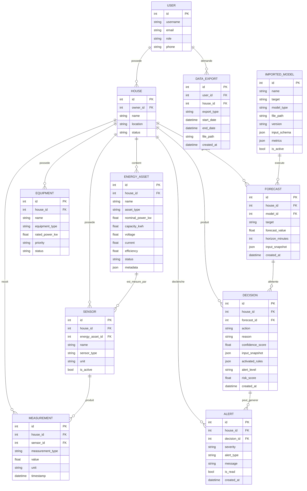
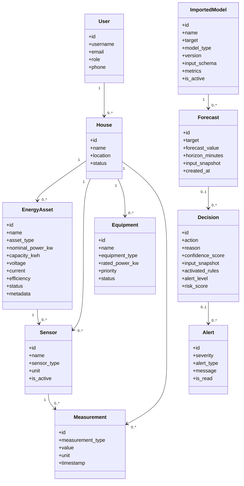
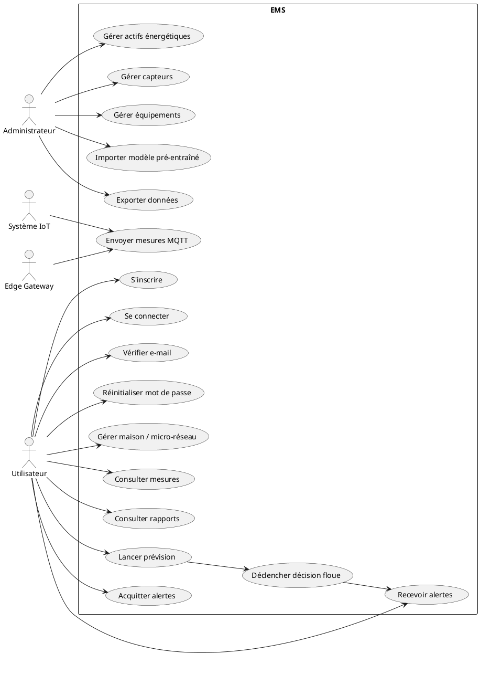
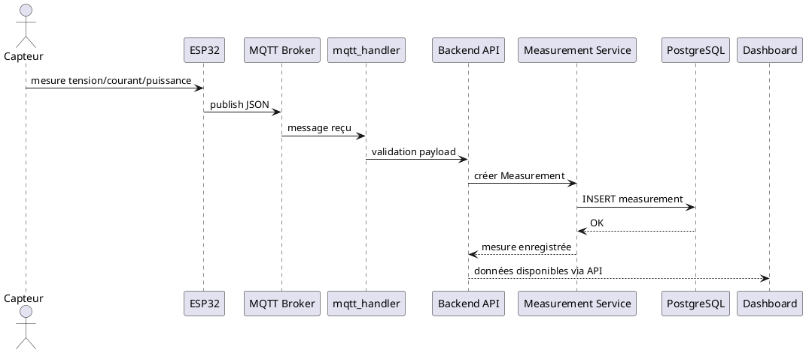
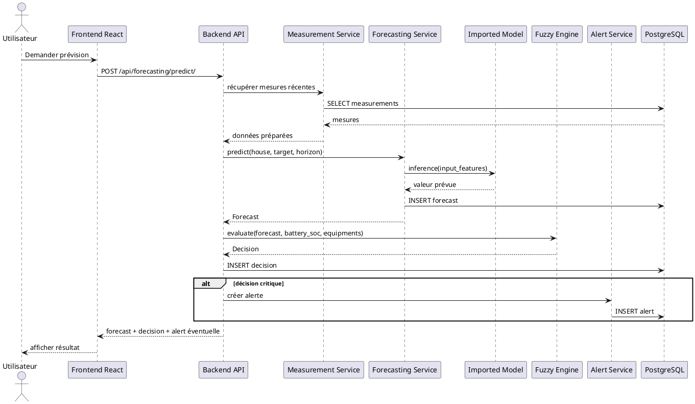
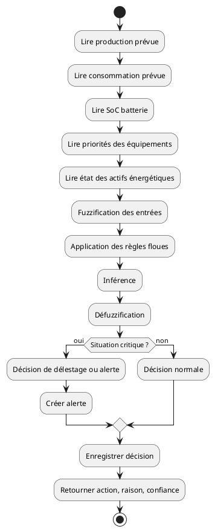
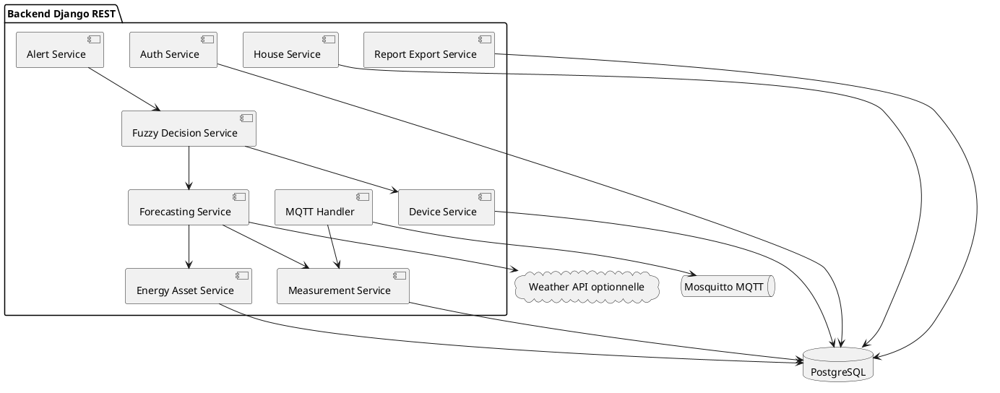
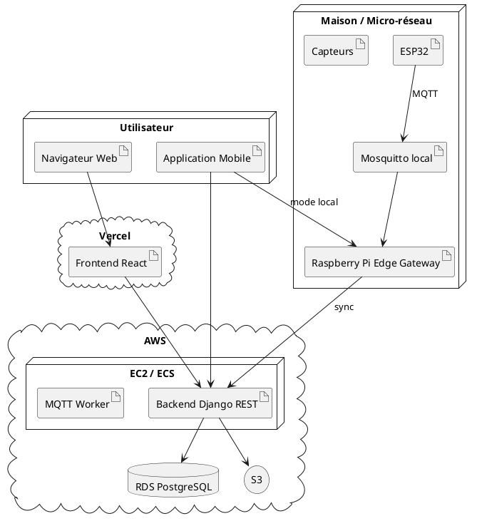

# EMS - Architecture, MCD, MLD, MPD et scripts de génération des diagrammes

Ce document rassemble les modèles de données et les scripts permettant de générer les diagrammes nécessaires au mémoire.

## 1. Architecture métier retenue

La structure conceptuelle retenue est :

```text
House / Micro-réseau
  -> EnergyAsset : éléments qui produisent, stockent ou convertissent l'énergie
  -> Sensor : éléments qui mesurent
  -> Equipment : charges consommant l'énergie
  -> Measurement : valeurs mesurées
  -> Forecast : prévisions de production ou de consommation
  -> Decision : décisions issues du système expert flou
  -> Alert : alertes produites par le système
```

Règle de séparation :

```text
House = site logique ou micro-réseau
EnergyAsset = actifs énergétiques physiques
Sensor = capteurs
Equipment = charges consommables ou délestables
Measurement = valeurs mesurées
Forecast = valeurs prédites
Decision = action énergétique recommandée
Alert = notification ou incident
```

## 2. MCD - Modèle conceptuel de données



## 3. MLD - Modèle logique de données

```text
USER(
  id PK,
  username,
  email UNIQUE,
  password,
  role,
  phone,
  phone_verified,
  preferences,
  created_at
)

EMAIL_VERIFICATION_TOKEN(
  id PK,
  user_id FK -> USER(id),
  token_hash,
  expires_at,
  used_at,
  created_at
)

PASSWORD_RESET_TOKEN(
  id PK,
  user_id FK -> USER(id),
  token_hash,
  expires_at,
  used_at,
  created_at
)

HOUSE(
  id PK,
  owner_id FK -> USER(id),
  name,
  location,
  latitude,
  longitude,
  description,
  status,
  created_at,
  updated_at
)

ENERGY_ASSET(
  id PK,
  house_id FK -> HOUSE(id),
  name,
  asset_type,
  nominal_power_kw,
  capacity_kwh,
  voltage,
  current,
  efficiency,
  status,
  metadata,
  created_at,
  updated_at
)

SENSOR(
  id PK,
  house_id FK -> HOUSE(id),
  energy_asset_id FK -> ENERGY_ASSET(id) NULL,
  name,
  sensor_type,
  unit,
  is_active,
  created_at
)

EQUIPMENT(
  id PK,
  house_id FK -> HOUSE(id),
  name,
  equipment_type,
  rated_power_kw,
  priority,
  status,
  created_at
)

MEASUREMENT(
  id PK,
  house_id FK -> HOUSE(id),
  sensor_id FK -> SENSOR(id) NULL,
  measurement_type,
  value,
  unit,
  timestamp,
  created_at
)

IMPORTED_MODEL(
  id PK,
  name,
  target,
  model_type,
  file_path,
  version,
  input_schema,
  metrics,
  is_active,
  imported_at
)

FORECAST(
  id PK,
  house_id FK -> HOUSE(id),
  model_id FK -> IMPORTED_MODEL(id) NULL,
  target,
  forecast_value,
  horizon_minutes,
  input_snapshot,
  created_at
)

DECISION(
  id PK,
  house_id FK -> HOUSE(id),
  forecast_id FK -> FORECAST(id) NULL,
  action,
  reason,
  confidence_score,
  input_snapshot,
  activated_rules,
  alert_level,
  risk_score,
  created_at
)

ALERT(
  id PK,
  house_id FK -> HOUSE(id),
  decision_id FK -> DECISION(id) NULL,
  severity,
  alert_type,
  message,
  is_read,
  created_at
)

DATA_EXPORT(
  id PK,
  user_id FK -> USER(id),
  house_id FK -> HOUSE(id),
  export_type,
  start_date,
  end_date,
  file_path,
  created_at
)
```

## 4. MPD - Modèle physique PostgreSQL

```sql
CREATE TABLE users_user (
    id BIGSERIAL PRIMARY KEY,
    username VARCHAR(150),
    email VARCHAR(254) UNIQUE NOT NULL,
    password VARCHAR(128) NOT NULL,
    role VARCHAR(20) NOT NULL DEFAULT 'USER',
    phone VARCHAR(30),
    phone_verified BOOLEAN NOT NULL DEFAULT FALSE,
    preferences JSONB NOT NULL DEFAULT '{}'::jsonb,
    created_at TIMESTAMP WITH TIME ZONE NOT NULL DEFAULT NOW()
);

CREATE TABLE users_emailverificationtoken (
    id BIGSERIAL PRIMARY KEY,
    user_id BIGINT NOT NULL REFERENCES users_user(id) ON DELETE CASCADE,
    token_hash VARCHAR(128) NOT NULL,
    expires_at TIMESTAMP WITH TIME ZONE NOT NULL,
    used_at TIMESTAMP WITH TIME ZONE,
    created_at TIMESTAMP WITH TIME ZONE NOT NULL DEFAULT NOW()
);

CREATE TABLE users_passwordresettoken (
    id BIGSERIAL PRIMARY KEY,
    user_id BIGINT NOT NULL REFERENCES users_user(id) ON DELETE CASCADE,
    token_hash VARCHAR(128) NOT NULL,
    expires_at TIMESTAMP WITH TIME ZONE NOT NULL,
    used_at TIMESTAMP WITH TIME ZONE,
    created_at TIMESTAMP WITH TIME ZONE NOT NULL DEFAULT NOW()
);

CREATE TABLE houses_house (
    id BIGSERIAL PRIMARY KEY,
    owner_id BIGINT NOT NULL REFERENCES users_user(id) ON DELETE CASCADE,
    name VARCHAR(120) NOT NULL,
    location VARCHAR(255),
    latitude DOUBLE PRECISION,
    longitude DOUBLE PRECISION,
    description TEXT,
    status VARCHAR(20) NOT NULL DEFAULT 'ACTIVE',
    created_at TIMESTAMP WITH TIME ZONE NOT NULL DEFAULT NOW(),
    updated_at TIMESTAMP WITH TIME ZONE NOT NULL DEFAULT NOW()
);

CREATE TABLE energy_assets_energyasset (
    id BIGSERIAL PRIMARY KEY,
    house_id BIGINT NOT NULL REFERENCES houses_house(id) ON DELETE CASCADE,
    name VARCHAR(120) NOT NULL,
    asset_type VARCHAR(30) NOT NULL,
    nominal_power_kw DOUBLE PRECISION,
    capacity_kwh DOUBLE PRECISION,
    voltage DOUBLE PRECISION,
    current DOUBLE PRECISION,
    efficiency DOUBLE PRECISION,
    status VARCHAR(20) NOT NULL DEFAULT 'ACTIVE',
    metadata JSONB NOT NULL DEFAULT '{}'::jsonb,
    created_at TIMESTAMP WITH TIME ZONE NOT NULL DEFAULT NOW(),
    updated_at TIMESTAMP WITH TIME ZONE NOT NULL DEFAULT NOW()
);

CREATE TABLE devices_sensor (
    id BIGSERIAL PRIMARY KEY,
    house_id BIGINT NOT NULL REFERENCES houses_house(id) ON DELETE CASCADE,
    energy_asset_id BIGINT REFERENCES energy_assets_energyasset(id) ON DELETE SET NULL,
    name VARCHAR(120) NOT NULL,
    sensor_type VARCHAR(30) NOT NULL,
    unit VARCHAR(20) NOT NULL,
    is_active BOOLEAN NOT NULL DEFAULT TRUE,
    created_at TIMESTAMP WITH TIME ZONE NOT NULL DEFAULT NOW()
);

CREATE TABLE devices_equipment (
    id BIGSERIAL PRIMARY KEY,
    house_id BIGINT NOT NULL REFERENCES houses_house(id) ON DELETE CASCADE,
    name VARCHAR(120) NOT NULL,
    equipment_type VARCHAR(80),
    rated_power_kw DOUBLE PRECISION,
    priority VARCHAR(20) NOT NULL DEFAULT 'NORMAL',
    status VARCHAR(20) NOT NULL DEFAULT 'ACTIVE',
    created_at TIMESTAMP WITH TIME ZONE NOT NULL DEFAULT NOW()
);

CREATE TABLE measurements_measurement (
    id BIGSERIAL PRIMARY KEY,
    house_id BIGINT NOT NULL REFERENCES houses_house(id) ON DELETE CASCADE,
    sensor_id BIGINT REFERENCES devices_sensor(id) ON DELETE SET NULL,
    measurement_type VARCHAR(30) NOT NULL,
    value DOUBLE PRECISION NOT NULL,
    unit VARCHAR(20) NOT NULL,
    timestamp TIMESTAMP WITH TIME ZONE NOT NULL,
    created_at TIMESTAMP WITH TIME ZONE NOT NULL DEFAULT NOW()
);

CREATE TABLE forecasting_importedmodel (
    id BIGSERIAL PRIMARY KEY,
    name VARCHAR(120) NOT NULL,
    target VARCHAR(20) NOT NULL,
    model_type VARCHAR(50) NOT NULL,
    file_path VARCHAR(255) NOT NULL,
    version VARCHAR(50) NOT NULL DEFAULT 'v1',
    input_schema JSONB NOT NULL DEFAULT '{}'::jsonb,
    metrics JSONB NOT NULL DEFAULT '{}'::jsonb,
    is_active BOOLEAN NOT NULL DEFAULT TRUE,
    imported_at TIMESTAMP WITH TIME ZONE NOT NULL DEFAULT NOW()
);

CREATE TABLE forecasting_forecast (
    id BIGSERIAL PRIMARY KEY,
    house_id BIGINT NOT NULL REFERENCES houses_house(id) ON DELETE CASCADE,
    model_id BIGINT REFERENCES forecasting_importedmodel(id) ON DELETE SET NULL,
    target VARCHAR(20) NOT NULL,
    forecast_value DOUBLE PRECISION NOT NULL,
    horizon_minutes INTEGER NOT NULL DEFAULT 60,
    input_snapshot JSONB NOT NULL DEFAULT '{}'::jsonb,
    created_at TIMESTAMP WITH TIME ZONE NOT NULL DEFAULT NOW()
);

CREATE TABLE fuzzy_engine_decision (
    id BIGSERIAL PRIMARY KEY,
    house_id BIGINT NOT NULL REFERENCES houses_house(id) ON DELETE CASCADE,
    forecast_id BIGINT REFERENCES forecasting_forecast(id) ON DELETE SET NULL,
    action VARCHAR(80) NOT NULL,
    reason TEXT,
    confidence_score DOUBLE PRECISION,
    input_snapshot JSONB NOT NULL DEFAULT '{}'::jsonb,
    activated_rules JSONB NOT NULL DEFAULT '[]'::jsonb,
    alert_level VARCHAR(20),
    risk_score DOUBLE PRECISION,
    created_at TIMESTAMP WITH TIME ZONE NOT NULL DEFAULT NOW()
);

CREATE TABLE alerts_alert (
    id BIGSERIAL PRIMARY KEY,
    house_id BIGINT NOT NULL REFERENCES houses_house(id) ON DELETE CASCADE,
    decision_id BIGINT REFERENCES fuzzy_engine_decision(id) ON DELETE SET NULL,
    severity VARCHAR(20) NOT NULL,
    alert_type VARCHAR(40) NOT NULL,
    message TEXT NOT NULL,
    is_read BOOLEAN NOT NULL DEFAULT FALSE,
    created_at TIMESTAMP WITH TIME ZONE NOT NULL DEFAULT NOW()
);

CREATE TABLE reports_dataexport (
    id BIGSERIAL PRIMARY KEY,
    user_id BIGINT NOT NULL REFERENCES users_user(id) ON DELETE CASCADE,
    house_id BIGINT NOT NULL REFERENCES houses_house(id) ON DELETE CASCADE,
    export_type VARCHAR(30) NOT NULL,
    start_date TIMESTAMP WITH TIME ZONE NOT NULL,
    end_date TIMESTAMP WITH TIME ZONE NOT NULL,
    file_path VARCHAR(255),
    created_at TIMESTAMP WITH TIME ZONE NOT NULL DEFAULT NOW()
);

CREATE INDEX idx_measurement_house_type_timestamp
ON measurements_measurement(house_id, measurement_type, timestamp DESC);

CREATE INDEX idx_sensor_asset
ON devices_sensor(energy_asset_id);

CREATE INDEX idx_forecast_house_created
ON forecasting_forecast(house_id, created_at DESC);

CREATE INDEX idx_decision_house_created
ON fuzzy_engine_decision(house_id, created_at DESC);

CREATE INDEX idx_alert_house_created
ON alerts_alert(house_id, created_at DESC);
```

## 5. Diagramme de classes UML



## 6. Diagramme de cas d'utilisation



## 7. Diagramme de séquence - collecte IoT



## 8. Diagramme de séquence - prévision et décision



## 9. Diagramme d'activité - système expert flou



## 10. Diagramme de composants backend



## 11. Diagramme de déploiement



## 12. Script de génération des diagrammes

Créer un dossier :

```bash
mkdir -p docs/diagrams/sources docs/diagrams/output
```

Installer Mermaid CLI :

```bash
npm install -g @mermaid-js/mermaid-cli
```

Installer PlantUML si Java est disponible :

```bash
# Ubuntu/Debian
sudo apt-get update
sudo apt-get install -y default-jre plantuml graphviz
```

Exemple de script `docs/diagrams/generate_diagrams.sh` :

```bash
#!/usr/bin/env bash
set -e

mkdir -p docs/diagrams/output

# Mermaid
mmdc -i docs/diagrams/sources/mcd.mmd -o docs/diagrams/output/mcd.png
mmdc -i docs/diagrams/sources/class_diagram.mmd -o docs/diagrams/output/class_diagram.png

# PlantUML
plantuml -tpng -o ../output docs/diagrams/sources/use_case.puml
plantuml -tpng -o ../output docs/diagrams/sources/sequence_iot.puml
plantuml -tpng -o ../output docs/diagrams/sources/sequence_forecast_decision.puml
plantuml -tpng -o ../output docs/diagrams/sources/activity_fuzzy_engine.puml
plantuml -tpng -o ../output docs/diagrams/sources/component_backend.puml
plantuml -tpng -o ../output docs/diagrams/sources/deployment.puml

echo "Diagrammes générés dans docs/diagrams/output"
```

Rendre le script exécutable :

```bash
chmod +x docs/diagrams/generate_diagrams.sh
./docs/diagrams/generate_diagrams.sh
```

## 13. Liste des diagrammes à insérer dans le mémoire

```text
1. Diagramme de contexte du système EMS
2. Diagramme de cas d'utilisation
3. Diagramme de classes UML
4. MCD Merise
5. MLD
6. MPD PostgreSQL
7. Diagramme de séquence de collecte IoT
8. Diagramme de séquence prévision-décision
9. Diagramme d'activité du système expert flou
10. Diagramme de composants backend
11. Diagramme de déploiement Edge-Cloud
```
