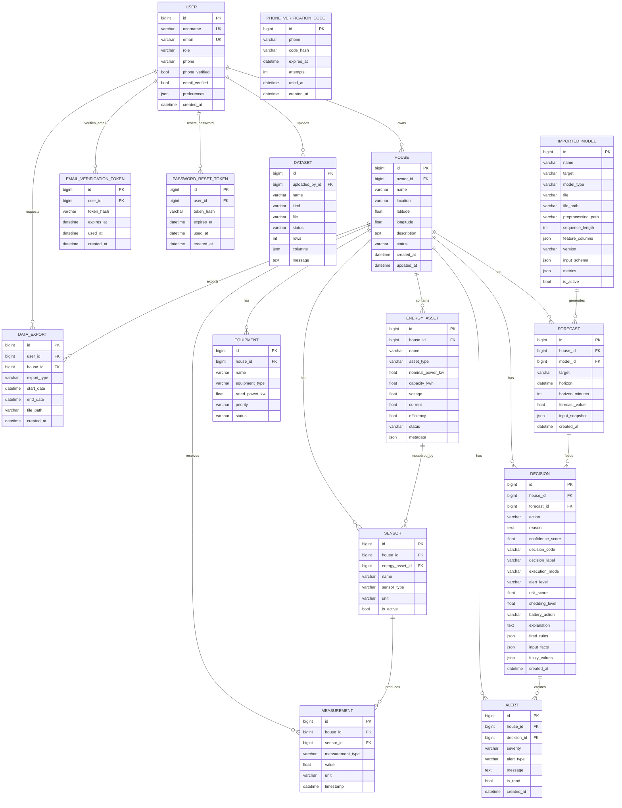
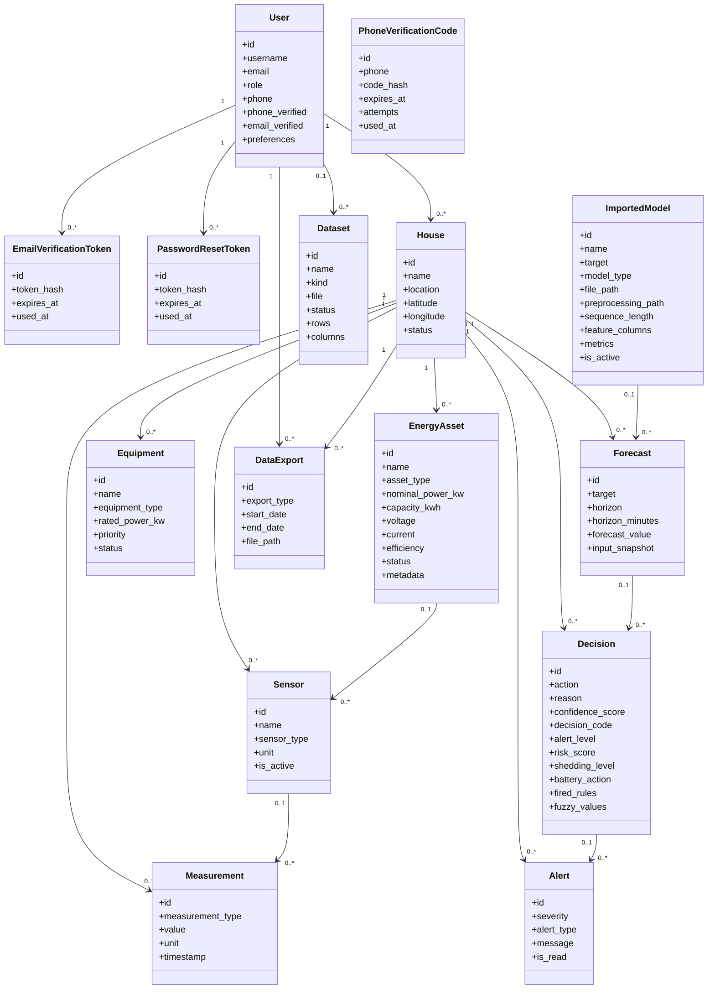

# EMS - Diagrammes actuels de la base de donnees

Date de reference : 2026-07-03

Source : modeles Django charges via `ems-backend/manage.py` et base locale `ems-backend/db.sqlite3`.

Ce document decrit le schema applicatif actuel. Les tables techniques Django (`auth_group`, `auth_permission`, `django_content_type`, `django_admin_log`, `django_session`, `django_migrations`) existent aussi dans la base, mais elles sont gardees a part pour ne pas rendre le diagramme illisible.

## Lecture rapide

Le centre du modele est `HOUSE`.

```text
USER
  -> HOUSE
      -> ENERGY_ASSET
      -> SENSOR
      -> EQUIPMENT
      -> MEASUREMENT
      -> FORECAST
      -> DECISION
      -> ALERT
      -> DATA_EXPORT

IMPORTED_MODEL -> FORECAST -> DECISION -> ALERT
ENERGY_ASSET -> SENSOR -> MEASUREMENT
```

Les changements importants par rapport a l'ancien schema :

- `Dataset` existe maintenant pour les imports CSV/JSON internes.
- `PhoneVerificationCode`, `EmailVerificationToken` et `PasswordResetToken` sont dans le module `users`.
- `ImportedModel` contient les champs ML recents : `file`, `preprocessing_path`, `sequence_length`, `feature_columns`.
- `Forecast.house_id` et `Forecast.model_id` sont optionnels.
- `Decision` contient maintenant beaucoup de champs d'inference floue avances.
- `User` garde les tables M2M Django `users_user_groups` et `users_user_user_permissions`.

## MCD / ERD



## MLD

```text
USER(
  id PK,
  password,
  last_login NULL,
  is_superuser,
  username UNIQUE,
  first_name,
  last_name,
  is_staff,
  is_active,
  date_joined,
  email UNIQUE,
  role,
  phone,
  phone_verified,
  email_verified,
  preferences,
  created_at
)

PHONE_VERIFICATION_CODE(
  id PK,
  phone INDEX,
  code_hash,
  expires_at,
  attempts,
  used_at NULL,
  created_at
)

EMAIL_VERIFICATION_TOKEN(
  id PK,
  user_id FK -> USER(id),
  token_hash,
  expires_at,
  used_at NULL,
  created_at
)

PASSWORD_RESET_TOKEN(
  id PK,
  user_id FK -> USER(id),
  token_hash,
  expires_at,
  used_at NULL,
  created_at
)

HOUSE(
  id PK,
  owner_id FK -> USER(id),
  name,
  location,
  latitude NULL,
  longitude NULL,
  description,
  status,
  created_at,
  updated_at
)

ENERGY_ASSET(
  id PK,
  house_id FK -> HOUSE(id),
  name,
  asset_type,
  nominal_power_kw NULL,
  capacity_kwh NULL,
  voltage NULL,
  current NULL,
  efficiency NULL,
  status,
  metadata,
  created_at,
  updated_at
)

SENSOR(
  id PK,
  house_id FK -> HOUSE(id),
  energy_asset_id FK -> ENERGY_ASSET(id) NULL,
  name,
  sensor_type,
  unit,
  is_active,
  created_at
)

EQUIPMENT(
  id PK,
  house_id FK -> HOUSE(id),
  name,
  equipment_type,
  rated_power_kw,
  priority,
  status,
  created_at
)

MEASUREMENT(
  id PK,
  house_id FK -> HOUSE(id),
  sensor_id FK -> SENSOR(id) NULL,
  measurement_type,
  value,
  unit,
  timestamp,
  created_at
)

DATASET(
  id PK,
  uploaded_by_id FK -> USER(id) NULL,
  name,
  kind,
  file,
  status,
  rows,
  columns,
  message,
  created_at
)

IMPORTED_MODEL(
  id PK,
  name,
  target,
  model_type,
  file NULL,
  file_path,
  preprocessing_path,
  sequence_length,
  feature_columns,
  version,
  input_schema,
  metrics,
  is_active,
  imported_at
)

FORECAST(
  id PK,
  house_id FK -> HOUSE(id) NULL,
  model_id FK -> IMPORTED_MODEL(id) NULL,
  target,
  horizon,
  horizon_minutes,
  forecast_value,
  input_snapshot,
  created_at
)

DECISION(
  id PK,
  house_id FK -> HOUSE(id),
  forecast_id FK -> FORECAST(id) NULL,
  action,
  reason,
  confidence_score,
  input_snapshot,
  activated_rules,
  decision_code,
  decision_label,
  execution_mode,
  alert_level,
  risk_score,
  shedding_level,
  charge_battery_score,
  discharge_battery_score,
  protect_battery_score,
  recommendation_score,
  automatic_score,
  blocked_score,
  battery_action,
  explanation,
  fired_rules,
  input_facts,
  fuzzy_values,
  created_at
)

ALERT(
  id PK,
  house_id FK -> HOUSE(id),
  decision_id FK -> DECISION(id) NULL,
  severity,
  alert_type,
  message,
  is_read,
  created_at
)

DATA_EXPORT(
  id PK,
  user_id FK -> USER(id),
  house_id FK -> HOUSE(id),
  export_type,
  start_date NULL,
  end_date NULL,
  file_path,
  created_at
)

USER_GROUPS(
  id PK,
  user_id FK -> USER(id),
  group_id FK -> AUTH_GROUP(id),
  UNIQUE(user_id, group_id)
)

USER_USER_PERMISSIONS(
  id PK,
  user_id FK -> USER(id),
  permission_id FK -> AUTH_PERMISSION(id),
  UNIQUE(user_id, permission_id)
)
```

## MPD

Noms physiques des tables applicatives :

```text
users_user
users_phoneverificationcode
users_emailverificationtoken
users_passwordresettoken
houses_house
energy_assets_energyasset
devices_sensor
devices_equipment
measurements_measurement
datasets_dataset
forecasting_importedmodel
forecasting_forecast
fuzzy_engine_decision
alerts_alert
reports_dataexport
```

Tables techniques Django liees :

```text
users_user_groups
users_user_user_permissions
auth_group
auth_group_permissions
auth_permission
django_content_type
django_admin_log
django_session
django_migrations
```

Index principaux declares dans les modeles :

```text
users_phoneverificationcode(phone)

energy_assets_energyasset(house_id, asset_type)
energy_assets_energyasset(status)

measurements_measurement(house_id, measurement_type, timestamp DESC)
measurements_measurement(sensor_id, timestamp DESC)
measurements_measurement(timestamp)

forecasting_importedmodel(target, is_active)
forecasting_importedmodel(model_type)
forecasting_forecast(house_id, created_at)
forecasting_forecast(house_id, target, horizon)

fuzzy_engine_decision(created_at)
alerts_alert(created_at)
```

Toutes les clefs etrangeres Django generent aussi des index physiques dans SQLite/PostgreSQL.

## Diagramme de classes UML



## Generation en image

Les sources Mermaid sont aussi sorties ici :

```text
docs/diagrams/sources/database_current_erd.mmd
docs/diagrams/sources/database_current_class.mmd
docs/diagrams/sources/database_current_erd.dot
```

Commande possible si Mermaid CLI est disponible :

```bash
mkdir -p docs/diagrams/output
npx @mermaid-js/mermaid-cli -i docs/diagrams/sources/database_current_erd.mmd -o docs/diagrams/output/database_current_erd.svg
npx @mermaid-js/mermaid-cli -i docs/diagrams/sources/database_current_class.mmd -o docs/diagrams/output/database_current_class.svg
```

Rendu Graphviz local :

```bash
mkdir -p docs/diagrams/output
dot -Tsvg docs/diagrams/sources/database_current_erd.dot -o docs/diagrams/output/database_current_erd_graphviz.svg
dot -Tpng docs/diagrams/sources/database_current_erd.dot -o docs/diagrams/output/database_current_erd_graphviz.png
```

Rendus deja generes :

```text
docs/diagrams/output/database_current_erd_graphviz.svg
docs/diagrams/output/database_current_erd_graphviz.png
```
