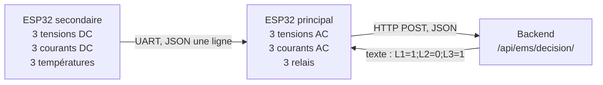

# Protocole ESP32 ↔ backend

> Toute modification du protocole doit être répercutée ici **et** dans
> `apps/devices/views.py::EmsDecisionView`.

Dernière mise à jour : **27/07/2026**

---

## 1. Vue d'ensemble

Deux nœuds, un seul interlocuteur du backend.



Le nœud secondaire **ne parle jamais au backend**. Il n'a ni Wi-Fi à gérer, ni
jeton, ni horloge : il mesure et il transmet. Un seul point d'authentification,
un seul point de configuration réseau.

| Grandeur | Nœud | Nature |
|---|---|---|
| Tension / courant par ligne AC | principal | mesurée (ZMPT101B / ZMCT103C) |
| Puissance par ligne AC | principal | **calculée** `V × I × cos φ` |
| Tension / courant batterie | secondaire | mesurée |
| Tension / courant PV | secondaire | mesurée |
| Températures (batteries, panneau) | secondaire | mesurée (DS18B20) |
| Puissances DC | backend | **calculée** `V × I` |
| SOC | backend | **estimé** (cf. `core/soc.py`) |

Ce que le système **calcule** et ce qu'il **mesure** ne se confondent pas. Un
SOC n'est jamais mesuré : aucun capteur ne lit « 62 % ».

---

## 2. Trame UART — secondaire → principal

**JSON sur une seule ligne**, terminée par `\n`, 115200 bauds. Une ligne = un
relevé complet ; pas de trame partielle.

```json
{"batteryVoltage_v":12.66,"batteryCurrent_a":0.10,"batteryTemp_c":27.5,
 "battery2Voltage_v":12.58,"battery2Current_a":-0.42,"battery2Temp_c":28.1,
 "pvVoltage_v":18.2,"pvCurrent_a":1.40,"panelTemp_c":44.0,"seq":1843}
```

**Suffixe d'unité obligatoire dans le nom** (`_v`, `_a`, `_c`) : c'est la règle
du dépôt (§7 du cahier de refonte, `docs/MEASUREMENTS_UNITS.md`). Un champ
nommé `battery` sans unité a coûté un facteur 1000 dans l'historique de ce
projet.

### Conventions

| Champ | Unité | Règle |
|---|---|---|
| `*Voltage_v` | V | toujours positif |
| `*Current_a` | A | **SIGNÉ : positif = charge, négatif = décharge** |
| `*Temp_c` | °C | valeur de la sonde, jamais corrigée |
| `seq` | — | compteur incrémental, détecte les trames perdues |

> ⚠ **Le signe du courant batterie n'est pas négociable.** Sans lui,
> impossible de distinguer une batterie qui se remplit d'une batterie qui se
> vide — donc impossible de compter les coulombs, donc impossible d'estimer un
> SOC autrement qu'au repos.

### Champ absent ≠ champ à zéro

Une sonde qui ne répond pas doit faire **omettre le champ**, jamais envoyer
`0`. Une température de 0 °C est une information ; une sonde débranchée en est
une autre, et le moteur les traite différemment — l'une déclenche la règle de
froid, l'autre dégrade la qualité des données et bloque la décision.

Le nœud principal recopie tel quel ce qu'il a reçu. Il ne complète pas, il ne
moyenne pas, il n'invente pas.

---

## 3. Charge utile HTTP — principal → backend

```
POST /api/ems/decision/
X-Device-Token: <device_token>
Content-Type: application/json
```

```json
{
  "line1": {"vSensorRms": 1.84, "iSensorRms": 0.052,
            "voltage": 220.4, "current": 0.055, "power": 12.1},
  "line2": {"vSensorRms": 1.86, "iSensorRms": 0.081,
            "voltage": 221.2, "current": 0.090, "power": 19.9},
  "line3": {"vSensorRms": 1.83, "iSensorRms": 0.049,
            "voltage": 219.6, "current": 0.050, "power": 11.0},
  "dc": {
    "batteryVoltage": 12.66, "batteryCurrent": 0.10, "batteryTemp": 27.5,
    "pvVoltage": 18.2, "pvCurrent": 1.40, "panelTemp": 44.0
  },
  "relays": {"l1": 1, "l2": 1, "l3": 1},
  "totalPower": 43.0
}
```

### Par ligne

| Champ | Unité | Rôle |
|---|---|---|
| `vSensorRms` | V (ADC) | valeur **brute** du capteur, avant calibration |
| `iSensorRms` | V (ADC) | idem |
| `voltage` | V | `vSensorRms × CAL_Vx + OFFSET_Vx` |
| `current` | A | `iSensorRms × CAL_Ix + OFFSET_Ix` |
| `power` | **W** | `voltage × current × cos φ` |

Les valeurs **brutes sont conservées** parce qu'elles permettent de recalculer
un coefficient plus tard sans refaire la manipulation physique au multimètre.
Un historique recalibré rétroactivement à partir de valeurs déjà calibrées
serait faux deux fois.

### Bloc `dc` — facultatif

Absent tant que le nœud secondaire n'est pas posé. Le backend enregistre alors
uniquement les lignes AC, et le moteur **dit qu'il ne sait pas** pour le SOC et
la production — il ne substitue plus de valeur par défaut.

| Champ | Unité | Type de mesure produit |
|---|---|---|
| `batteryVoltage` | V | `battery_voltage` |
| `batteryCurrent` | A signé | `battery_current` |
| `batteryTemp` | °C | `battery_temp` |
| `pvVoltage` | V | `pv_voltage` |
| `pvCurrent` | A | `pv_current` |
| `panelTemp` | °C | `panel_temp` |

Le backend en dérive `battery_power` (W), `pv_power` (W) et `production` (kW).

---

## 4. Authentification

Le jeton voyage dans l'en-tête **`X-Device-Token`**.

```
X-Device-Token: 8f3a...c21
```

**Pourquoi pas dans l'URL.** Une URL finit dans les journaux d'accès de Nginx,
dans l'historique du navigateur et dans l'en-tête `Referer` des requêtes
suivantes. Un jeton qui y figure est un jeton diffusé, et il ne peut pas être
révoqué sans reflasher le nœud.

Le paramètre d'URL `?token=` reste **accepté en lecture** — un nœud déjà posé
sur un mur ne se met pas à jour à distance — mais chaque usage est signalé
comme obsolète dans les journaux du backend.

### Il n'y a pas de mode « sans jeton »

| Situation | Réponse |
|---|---|
| Aucun jeton | `403` — `ERR=missing_token` |
| Jeton inconnu | `403` — `ERR=invalid_token` |
| Jeton valide | `200` — `L1=1;L2=0;L3=1` |

> **Faille corrigée le 27/07/2026.** Sans jeton, l'endpoint sélectionnait le
> `RelayState` le plus récemment piloté, **toutes maisons et tous utilisateurs
> confondus**. Quiconque pouvait atteindre le port 8000 recevait l'état des
> relais du dernier micro-réseau actif — et le pilotait en lui renvoyant des
> mesures. Sur un réseau domestique partagé, cela suffit. Le mode de repli a
> été supprimé.

Le jeton n'est **plus exposé** par l'API (`RelayStateSerializer`) : il
transitait à chaque affichage de la page Équipements. Le provisionnement d'un
nœud passe par l'administration.

---

## 5. Réponse du backend

Texte brut, une ligne, `Content-Type: text/plain` :

```
L1=1;L2=0;L3=1
```

`1` = ligne alimentée (relais fermé), `0` = ligne coupée. Espaces et casse
tolérés côté firmware.

Le format reste volontairement trivial : le nœud doit pouvoir l'analyser sans
bibliothèque JSON, et une réponse tronquée doit être détectable. La décision
détaillée, ses règles et son explication vivent côté backend — le nœud n'a pas
à les connaître pour appliquer une consigne.

### Le garde-fou local reste souverain

`clampDecision()` s'applique **à toute décision automatique, y compris celle du
backend**. Une ligne en surcharge n'est jamais alimentée, quoi que réponde le
serveur. C'est la dernière barrière, celle qui ne dépend ni du réseau ni du
moteur.

---

## 6. Cadences

| Événement | Période |
|---|---|
| Mesure et sondage du nœud | 3 s |
| Persistance des mesures | 30 s |
| Réestimation du SOC | 30 s (à chaque persistance) |
| Évaluation du système expert | 30 s |
| Fenêtre de confirmation en mode automatique | 180 s |

La réestimation du SOC est faite **à l'arrivée des mesures** et non à la
lecture des faits : le comptage coulométrique doit voir *chaque* relevé. Un pas
manqué, c'est de l'énergie qui a circulé sans être comptée, et l'erreur ne se
rattrape pas.

---

## 7. Ce qui reste à faire

- Le nœud secondaire n'est **pas encore monté** : le bloc `dc` n'est jamais
  émis à ce jour. Le backend l'accepte déjà, et les tests le couvrent.
- Le firmware envoie encore le jeton dans l'URL.
- L'adresse du backend impose une recompilation (`BACKEND_HOST_STR`).
  Configuration par série / NVS / mDNS envisagée, non implémentée.
