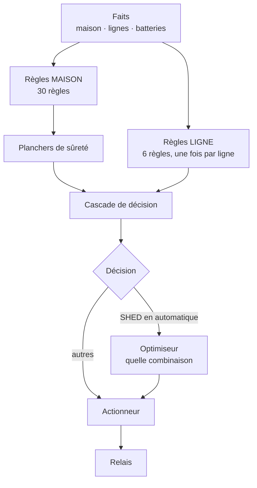
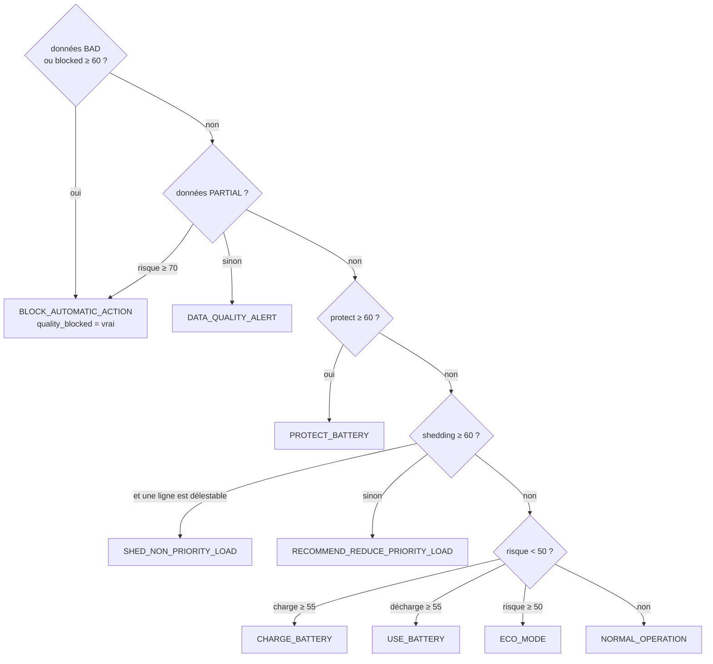

# Le système expert flou — architecture après refonte

> Source de vérité du raisonnement. Toute modification des faits, des variables
> linguistiques, des règles, des seuils ou de la cascade doit être répercutée
> ici **et** mesurée par `python -m tools.fuzzy_bench`.

Dernière mise à jour : **27/07/2026**

---

## 1. Le principe d'ensemble

Le moteur répond à trois questions distinctes, dans cet ordre, et **ne les
confond jamais** :



| Couche | Question | Où |
|---|---|---|
| Règles maison | La situation est-elle tenable ? | `core/rules.py` |
| Planchers | La gravité est-elle continue ? | `core/safety.py` |
| Cascade | Que faut-il faire ? | `core/decision_mapper.py` |
| Règles ligne | Que peut-on couper, à quel coût ? | `core/line_rules.py` |
| Optimiseur | Quelle combinaison couper ? | `core/optimizer.py` |

**Cette séparation est ce qui préserve l'explicabilité.** On peut toujours dire
« pourquoi » (la règle maison), puis « pourquoi cette ligne-là » (la règle de
ligne et le coût). Les fondre dans un calcul unique donnerait un nombre à la
place d'un raisonnement.

### `core/` ne connaît pas Django

Aucun module de `core/` n'importe Django, `django.db`, ni un modèle ORM. C'est
une contrainte tenue, pas une intention : elle permet d'exécuter le moteur sur
des centaines de milliers de situations en quelques dizaines de secondes, donc
de **prouver** ses propriétés au lieu de les affirmer. L'accès à la base reste
dans `engine.py`, qui assemble les faits et les passe au moteur.

---

## 2. Les faits

### 2.1 Faits maison (`EnergyFacts`)

| Fait | Unité | Source | Absent ? |
|---|---|---|---|
| `current_pv_power_kw` | kW | bloc DC du nœud | 0 |
| `current_load_power_kw` | kW | somme des lignes AC | 0 |
| `forecast_pv_energy_kwh` | kWh | prévision RF, intégrée sur 24 h | repli sur la puissance courante |
| `forecast_load_energy_kwh` | kWh | prévision GRU, idem | idem |
| `battery_soc_percent` | % | agrégat du parc, **pondéré par capacité** | **`None`** |
| `battery_temperature_c` | °C | la **plus défavorable** du parc | **`None`** |
| `load_priority` | — | priorité de la charge la plus prioritaire | `NON_PRIORITY` |
| `data_quality` | — | GOOD / PARTIAL / BAD | — |
| `data_completeness` | 0–1 | fraction de faits présents | `None` |
| `autonomy_hours` | h | **dérivé** du parc | `None` |
| `ambient_temperature_c` | °C | API météo | `None` |
| `solar_irradiance_wm2` | W/m² | API météo | `None` |
| `module_temperature_c` | °C | sonde module | `None` |
| `hour`, `day_of_week` | — | horloge | `None` |
| `operating_mode` | — | `RelayState.control_mode` | `MANUAL` |
| `lines`, `batteries` | — | assemblés depuis la base | listes vides |

**`None` n'est pas une valeur manquante à combler.** Le moteur substituait
50 % de SOC et 25 °C en silence : le résultat avait l'air d'une batterie à
moitié pleine et tempérée, alors que c'était l'absence de mesure. Onze règles
raisonnaient sur ces chiffres, et R015 affirmait « la température est normale »
— une assertion que le système n'avait aucun moyen de faire. Désormais un fait
absent n'appartient à **aucun** terme flou : aucune règle ne se déclenche, ni
dans le sens de l'alarme ni dans celui du calme, la qualité des données se
dégrade et la décision se bloque.

### 2.2 Faits par ligne (`LineFacts`)

Une ligne **n'est pas une charge** : plusieurs charges lui sont rattachées en
parallèle. La priorité d'une ligne est celle de la charge **la plus
prioritaire** qu'elle alimente — jamais une moyenne, puisque couper la ligne
coupe tout ce qu'elle porte.

`is_measured` distingue « ligne à 0 W » de « ligne dont on ne sait rien ». Un
0 W inventé ferait croire à l'optimiseur qu'il ne gagne rien à la couper.

### 2.3 Faits par batterie (`BatteryFacts`)

`soc_method` (`OCV` | `COULOMB` | `BMS` | `UNKNOWN`) et
`soc_uncertainty_percent` accompagnent toujours le SOC. Un SOC estimé par
tension au repos à ±10 % et un SOC lu d'un BMS à ±2 % ne se ressemblent que si
l'on tait la méthode.

---

## 3. Variables linguistiques

| Variable | Univers | Termes |
|---|---|---|
| SOC batterie | 0–100 % | `critical` `low` `medium` `high` |
| Température batterie | **−20 à 100 °C** | **`cold`** `normal` `high` `dangerous` |
| Bilan prévisionnel | 0–2 | `critical_deficit` `deficit` `balanced` `surplus` |
| Charge actuelle | 0–3 | `low` `medium` `high` |
| Production PV | 0–1 | `very_low` `low` `medium` `high` |
| **Autonomie** | **0–72 h** | `critical` `short` `comfortable` `large` |
| **Part de puissance d'une ligne** | **0–1** | `negligible` `moderate` `dominant` |
| Qualité des données | — | `good` `partial` `bad` |

L'univers de température s'arrêtait à 0 °C : une batterie à −15 °C était
ramenée à 0 °C et lue comme « normale ». Or la charger à cette température
dépose du lithium métallique sur l'anode — une perte de capacité
**irréversible**, contrairement à un échauffement.

Deux variables sont **relatives** (bilan, part de ligne) : « 20 W » ne veut
rien dire seul, c'est énorme sur ce prototype de 120 W et négligeable sur une
installation de 3 kW. Les mêmes règles doivent valoir dans les deux cas.

### 3.1 Prémisses cumulatives

Une règle qui veut dire « la batterie est faible **ou pire** » écrivait
`fuzzy_or(low, critical)`. Ce n'est pas ce que cela signifie : `low` est un
triangle qui culmine à 30 % puis **redescend**.

```
appartenance
   1.0 |    /\                    ← low, sommet à 30 %
       |   /  \
   0.4 |__/____\___  ← puits mesuré à 0,40 vers 21 % de SOC
       | /   ‾‾‾\
       |/         \
       +---------------------- SOC
        15  21  30   45
```

Une batterie à 21 % était donc réputée **moins faible** qu'à 30 %. Conséquence
observée : entre 24,00 % et 23,75 % de SOC, le moteur **cessait de délester**.
Même puits sur la production (0,33 à 20 % de ratio contre 1,00 à 35 %).

Les lectures cumulatives (`soc_at_most_low`, `pv_at_most_low`,
`balance_at_most_deficit`, `autonomy_at_most_short`) reprennent le **sommet et
le pied** du terme concerné en saturant du côté du danger. Aucun paramètre
nouveau : la monotonie devient vraie par construction, pas par chance.

---

## 4. Base de règles maison — 30 règles

| Codes | Objet |
|---|---|
| R001–R004 | température et SOC de la batterie |
| R005–R011 | déficit énergétique et priorité des charges |
| R012–R016 | surplus, équilibre |
| R017–R018, R024 | qualité des données |
| R019–R023 | tension immédiate, mode économie, protection |
| **R025** | **batterie trop froide** — interdit la recharge |
| **R026–R027** | **autonomie** critique / courte |
| **R028–R029** | **bilan prévisionnel seul** |
| **R030** | **le creux de production est couvert** |
| **R031–R036** | **irradiance, module, ambiante, heure, jour** |
| **R037–R038** | **régime de pilotage** |

### Un conséquent rassurant est toujours mort

L'agrégation retient le **maximum pondéré** par indicateur. Écrire
`risk_score: 10` sur une règle qui constate que tout va bien ne peut **rien**
abaisser : une seule règle plus engagée l'écrase. 16 couples (règle,
conséquent) étaient dans ce cas et ont été retirés — ils donnaient l'illusion
d'une base plus riche qu'elle ne l'était.

Pour exprimer « la situation est calme », il ne faut pas un score bas : il faut
porter la prémisse de relâchement dans une règle concurrente
(`_shortfall_is_covered`).

### Le creux de production peut être couvert

R019 (« production faible **et** charge élevée ») se déclenchait à l'identique
que la batterie soit pleine ou vide et que la prévision soit bonne ou mauvaise
— ni le stockage ni le bilan n'apparaissaient dans sa prémisse. Le moteur
recommandait donc de réduire la consommation avec une batterie à 100 % et un
excédent annoncé, ce à quoi servent pourtant exactement une batterie et une
prévision.

```
_shortfall_is_covered = autonomie confortable
                     OU (excédent prévu ET batterie pas basse)
```

Disjonction : ce sont deux raisons **distinctes** de ne pas s'alarmer. Elle
vaut 0 quand l'autonomie est inconnue et le bilan déficitaire — le moteur ne se
rassure jamais sur une donnée qu'il n'a pas.

---

## 5. Agrégation et planchers de sûreté

### 5.1 Maximum pondéré

`aggregation.py` combine les conséquents scalaires pondérés par le degré
d'activation, en gardant le **maximum** par indicateur. Ce n'est pas une
défuzzification — il n'y a pas d'ensemble flou de sortie à réduire — et
l'appeler ainsi égarait le lecteur.

Trois alternatives mesurées, toutes dégradantes :

| Piste | Résultat |
|---|---|
| Somme probabiliste | risque moyen 69 → 89, protection 30 % → 55 % : saturation |
| Moyenne pondérée (Sugeno) | bilan prévisionnel inerte dans **76 %** des cas |
| Partitions ε-complètes | inversions 3 → 6, écart-type du risque 31,7 → 22,9 |

### 5.2 Les planchers

Les frontières de décision **ne sont pas choisies : elles émergent** du produit
`effet_de_la_règle × seuil_de_l_indicateur`. R003 porte `protect = 85` contre
un seuil de 60 : il faut donc une activation de 60/85 = 0,706, que « critique »
n'atteint qu'à **17,9 %** de SOC. Personne n'a écrit 17,9 quelque part.

Quand deux frontières émergentes ne se recouvrent pas, il reste un **trou** :

| Zone | Comportement mesuré avant correction |
|---|---|
| SOC 19,7 % – 26,5 % | « fonctionnement normal », alors que 30 % donnait « mode économie » |
| Température 48 – 55 °C | idem |

La gravité **décroissait** alors que le danger croissait.

```
score = max(score_des_règles, plancher(SOC, T))
```

Le plancher ne peut que **relever**. Il laisse intactes les appartenances, les
règles et les seuils — c'est ce qui permet de le poser sans recalibrer
l'ensemble. Chaque plancher est le **maximum** de trois rampes, jamais leur
somme : un SOC bas et une batterie chaude sont deux dangers distincts, pas un
danger deux fois plus grand.

| Plancher | SOC | Chaud | Froid |
|---|---|---|---|
| Risque | 50 % → 5 % | 35 → 60 °C | 5 → −10 °C |
| Protection | 35 % → 5 % | 50 → 60 °C | 10 → −5 °C |

Quand c'est le plancher qui décide, **l'explication le dit** : sans cela,
l'utilisateur lirait un score qu'aucune règle affichée ne justifie.

---

## 6. Cascade de décision



### Trois points où la cascade a été corrigée

**Un blocage qualité ne se requalifie jamais.** Le garde-fou « charge
critique » écrasait un `BLOCK_AUTOMATIC_ACTION` motivé par des données
inexploitables, avec pourtant `blocked_score = 100`. La piste d'audit affirmait
l'inverse de ce que le moteur avait conclu.

**Le délestage demande « ai-je une ligne à couper ? »**, plus « aucune charge
n'est-elle prioritaire ? ». Sur le prototype, une seule lampe IMPORTANT suffit
à faire échouer le second test en permanence : le délestage automatique était
**mathématiquement inatteignable**, quel que soit le danger. La cause n'était
pas un seuil mal réglé, c'était une question mal posée.

**Une action d'opportunité ne masque pas un risque élevé.** Annoncer « je
charge la batterie » avec un risque à 90 dit à l'utilisateur que tout va bien
au moment où le système constate le contraire. Charge et décharge ne passent
plus au-dessus du seuil du mode économie ; la consigne batterie part par
`battery_action`, canal **distinct** du code de décision.

### `recommendation_score` sert au niveau d'alerte

23 règles le renseignaient, aucune condition ne le lisait. Ce qu'il mesure,
c'est « à quel point je veux que l'humain intervienne » : sa place est le
niveau d'alerte, qui est bien consommé en aval. Il pèse **un cran de moins**
que le risque — conseiller fermement n'est pas constater un danger.

> **Piste essayée et écartée, avec sa mesure.** En faire un veto sur le mode
> d'exécution (« automatique seulement si `automatic ≥ recommendation` »). Sur
> les charges réelles du prototype, `automatic_score` n'est porté que par des
> règles exigeant `NON_PRIORITY` : il y tombait à **25,5** contre une
> recommandation à **95**, et le délestage automatique redevenait
> inatteignable — le défaut même que cette refonte corrige.

---

## 7. Règles par ligne — 6 règles

Évaluées **une fois par ligne**, elles lisent l'état de la ligne *et* le
contexte maison : une ligne ne se juge pas dans le vide, sa puissance ne
devient un problème que rapportée à un déficit.

| Code | Prémisse | Effet |
|---|---|---|
| `L001` | ligne délestable ∧ déficit critique maison | `shed_score` 95 |
| `L002` | ligne délestable ∧ risque élevé ∧ **hors heures de présence** | `shed_score` 70 |
| `L003` | ligne critique | `protect_score` 100 · **veto** |
| `L004` | ligne lourde ∧ déficit | `shed_score` 85 |
| `L005` | ligne déjà coupée | **veto** |
| `L006` | ligne non mesurée | **veto** |

**Les vétos** n'ajoutent pas du poids, ils **interdisent**. Un score, si haut
soit-il, ne peut pas les contredire : l'agrégation par maximum ne sait pas
exprimer « quoi qu'il arrive, non ».

**La délestabilité est graduée**, non binaire :

| Priorité | Délestabilité |
|---|---|
| `NON_CRITICAL` | 1,00 |
| `LOW` | 0,85 |
| `NORMAL` | 0,60 |
| `IMPORTANT` | 0,30 |
| `CRITICAL` | **0,00** |

C'est ce qui rend le délestage possible sur un prototype dont **aucune ligne
n'est « non prioritaire » au sens strict** : chacune porte au moins une lampe
normale. Couper une ligne importante coûte, sans être interdit. Seule une
charge critique constitue un veto.

---

## 8. L'optimiseur

Il intervient **après** le moteur flou, et seulement quand la décision est
`SHED_NON_PRIORITY_LOAD` en mode automatique.

```
J(y) = w_def · déficit non résorbé
     + w_pri · coût de confort
     + w_com · coût de commutation
```

sous contraintes : ligne critique jamais coupée, ligne non mesurée figée,
garde-fou de surcharge respecté. Les contraintes sont exprimées **comme
contraintes et non comme pénalités** — un coût, si élevé soit-il, finit par
être franchi quand le déficit grandit.

| Poids | Valeur | Rôle |
|---|---|---|
| `WEIGHT_DEFICIT` | 10,0 | dominant : ne pas résoudre coûte plus que gêner |
| `WEIGHT_PRIORITY` | 4,0 | coût de confort |
| `WEIGHT_SWITCHING` | 1,0 | départage en faveur de l'existant, évite le battement |

**Les trois termes sont normalisés sur [0, 1].** Ils n'étaient pas comparables :
le déficit se compte en watts, le confort en rangs, la commutation en relais.
Mesuré sur le prototype (3 W au total), le terme de déficit valait 30 contre 40
de confort et l'optimiseur préférait **ne rien faire** ; sur une installation
de 3 kW il aurait tout coupé.

**La cible D** se déduit de l'autonomie quand la réserve est connue
(`D = P_nette − E_utilisable / T`, seule définition physique du déficit), et
vaut sinon la puissance de la **plus petite ligne délestable** — l'action
minimale qui ait un sens. Lire `shedding_level` comme une fraction de la
consommation à retirer reviendrait, à 100 de score, à tout couper y compris la
ligne prioritaire : un degré de justification n'est pas une quantité de watts.

Résolution par **énumération exhaustive** (8 combinaisons à 3 lignes, exacte et
instantanée), repli glouton au-delà de 12 lignes qui **dit dans sa trace**
qu'il n'est plus exact. Aucune dépendance à un solveur externe.

L'optimiseur **ne rétablit pas** : le coût de confort porte sur la coupure, pas
sur l'état éteint. Le rétablissement a lieu un cran plus haut, quand la
décision cesse d'être un délestage. C'est un **constat** du moteur flou, pas un
équilibre de coûts.

---

## 9. Mesures — avant / après

Grille fixe et déterministe de **222 750 situations**
(`python -m tools.fuzzy_bench`).

| Mesure | Avant | Après |
|---|---|---|
| Données BAD non bloquées | 19,76 % | **0,00 %** |
| Inversions de gravité (échelle de danger) | — | **0** sur tous les axes |
| Inversions au barème prescrit | 38 | 19 |
| Creux du score de risque | 530 | 263 |
| Inertie du bilan, hors plancher | 42,89 % | **29,33 %** |
| Conséquents sous leur seuil | 11 | **0** |
| Conséquents sur indicateur non lu | 23 | **0** |
| Faits déclarés sans influence | 6 | **0** (sur 19) |
| Inertie de l'autonomie | — | **0,00 %** |
| Règles maison | 24 | 30 |
| Règles de ligne | 0 | 6 |

### Écarts assumés

- **`BLOCK_AUTOMATIC_ACTION` 45,7 % → 62,7 %** : conséquence directe du
  correctif du blocage qualité. Ces situations étaient déjà bloquées par les
  scores, elles étaient seulement mal étiquetées. La part reste élevée parce
  que deux tiers de la grille sont en qualité PARTIAL ou BAD — c'est une
  propriété de la grille, pas du moteur.
- **Écart-type du risque 24,7 → 19,6** : le plancher relève les situations
  basses, il ne peut pas en abaisser.
- **Inertie globale 64,2 % → 69,1 %** : elle est dominée par les situations où
  un plancher décide. Quand la batterie est presque vide ou en surchauffe, le
  fait que la production reprenne demain ne change rien à ce qu'il faut faire
  maintenant — l'inertie y est le comportement **correct**. C'est pourquoi la
  mesure hors plancher est reportée à côté.
- **263 creux du score de risque**, tous ≤ 1,1 point et sous tout seuil de
  décision. Propriété plus stricte que celle exigée (qui porte sur la gravité
  de la décision), mesurée et documentée plutôt que corrigée en retouchant une
  calibration prescrite.

### Les 19 inversions au barème prescrit

Toutes sont des transitions `CHARGE_BATTERY` → `NORMAL_OPERATION`. Le barème
mélange deux natures de décision : les **réponses à un danger** et les
**actions d'opportunité**, déclenchées par des conditions favorables. Passer de
« charger la batterie » à « fonctionnement normal » parce que la production
baisse n'est pas un relâchement face au danger, c'est une opportunité qui
disparaît. Le banc mesure donc les deux échelles ; c'est celle du **danger**
qui porte la propriété de sûreté exigible, et elle est à zéro.

---

## 10. Propriétés vérifiées

`tests/test_fuzzy_monotonicity.py`, sans Django ni base de données.

**Monotonie** — la gravité ne décroît jamais quand le danger croît, au pas de
0,25, sur le SOC, la température en deux branches séparées (le danger thermique
est en U), la charge, le bilan, la production, l'autonomie.

**Sûreté** — sous 0 °C jamais de recharge ; des données BAD bloquent toujours ;
une ligne critique n'est jamais coupée ; un SOC inconnu ne produit aucune
décision assurée.

**Atteignabilité** — le délestage est atteignable avec les lignes réelles du
prototype ; les 9 codes de décision sont atteints ; les 36 règles s'activent ;
les 19 faits influencent la sortie ; la trace suffit à rejouer le raisonnement.

**Optimiseur** (`tests/test_optimizer.py`) — balayage exhaustif des
2 400 configurations de trois lignes : aucune ne coupe une ligne vitale, ne
touche à une ligne non mesurée, ni ne dépasse le garde-fou de surcharge.

**SOC** (`tests/test_soc_estimation.py`) — la moitié des tests vérifie que
l'estimateur **refuse** de répondre. Un SOC faux ressemble trait pour trait à
un SOC juste, et rien en aval ne peut le rattraper.

---

## 11. Ce qui reste ouvert

- **Le nœud secondaire n'est pas monté.** Le bloc `dc` n'est jamais émis à ce
  jour ; le backend l'accepte et les tests le couvrent. Tant qu'il manque, le
  SOC vaut `UNKNOWN` et le moteur bloque ses décisions — c'est le comportement
  voulu, et il se verra en démonstration.
- **Les capteurs ne sont pas calibrés** (`CAL_Vx = 1.0`) : les puissances de
  ligne sont des RMS bruts, pas des watts.
- **`cos φ` n'est pas mesuré** : la puissance calculée est apparente (VA),
  assimilée à de l'actif. Correct pour des lampes, optimiste pour un chargeur à
  découpage.
- **Le score de risque n'est pas strictement monotone** (263 creux ≤ 1,1
  point). Corriger exigerait de retoucher les partitions et de recalibrer les
  seuils conjointement.
- **Les champs existants en kW restent en kW.** Tout ce qui est neuf porte son
  unité dans le nom et stocke en W / Wh.
