# EMS — Architecture complète, diagrammes et perspectives   des per

Document de synthèse : ce que le système **fait réellement** aujourd'hui (vérifié
dans le code, fichier par fichier), puis ce qu'il **reste à construire**.

Chaque affirmation renvoie au fichier qui la porte. Les diagrammes sont des
images SVG (visibles dans tout lecteur Markdown, y compris l'éditeur) ; leur
source Mermaid éditable est repliée sous chaque image (« Source Mermaid »).
Les SVG et sources vivent dans [diagrams/](diagrams/).

Documents détaillés complémentaires :
[architecture-systeme-expert.md](architecture-systeme-expert.md) ·
[ia-architecture-et-roadmap.md](ia-architecture-et-roadmap.md) ·
[api-endpoints.md](api-endpoints.md)

---

## 0. Vue d'ensemble

Le système se compose de quatre briques : un **nœud ESP32** (mesure + commande),
un **backend Django** (stockage, prévision ML, système expert flou), et deux
**interfaces** (web React + mobile Expo).


<details>
<summary>Source Mermaid (diagramme éditable)</summary>

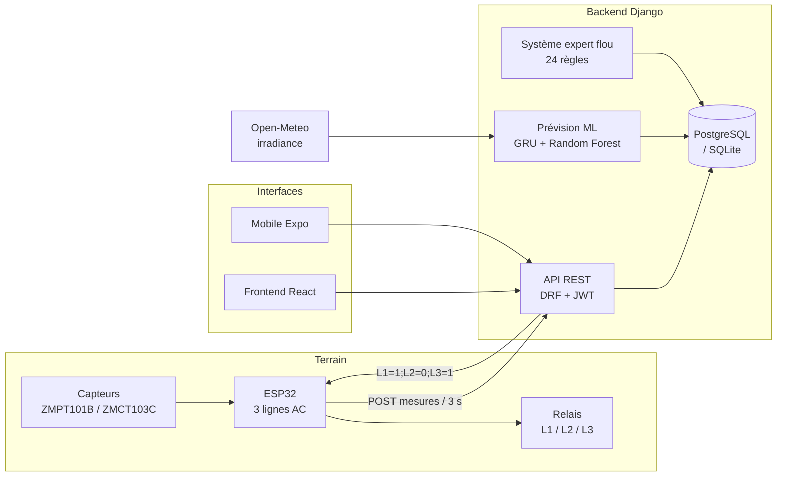

</details>

**Point structurant**, développé en [§4](#4-la-boucle-décision--relais--fermée) :
le système expert peut désormais **commander les relais** en mode `AUTO`
(boucle fermée), tout en restant consultatif en mode `MANUAL` (défaut).

---

## 1. Système expert flou

Cœur décisionnel du mémoire. Implémentation : `ems-backend/apps/fuzzy_engine/`.

### 1.1 Organisation du code

`engine.py` (239 lignes) est une **façade** de compatibilité ; le moteur réel est
le package `core/` (892 lignes). Ce n'est pas un doublon — la façade adapte les
faits d'une maison vers le moteur pur.


<details>
<summary>Source Mermaid (diagramme éditable)</summary>

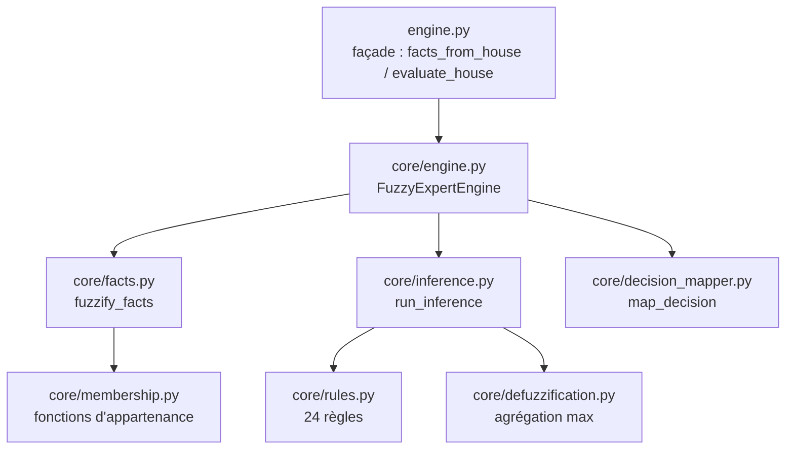

</details>

### 1.2 Pipeline en 4 étapes


<details>
<summary>Source Mermaid (diagramme éditable)</summary>

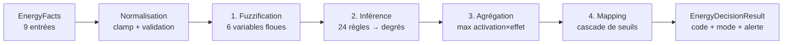

</details>

### 1.3 Entrées — `EnergyFacts` (`core/models.py`)

| Champ | Unité | Origine réelle (`engine.py:facts_from_house`) |
|-------|-------|-----------------------------------------------|
| `current_pv_power_kw` | kW | dernière mesure `production` |
| `current_load_power_kw` | kW | dernière mesure `consumption` |
| `forecast_pv_energy_kwh` | kWh | intégration des prévisions 24 h |
| `forecast_load_energy_kwh` | kWh | idem, cible `consumption` |
| `battery_soc_percent` | % | dernière mesure `battery_soc` (défaut 50) |
| `battery_temperature_c` | °C | dernière mesure `temperature` (défaut 25) |
| `load_priority` | — | `CRITICAL` / `PRIORITY` / `NON_PRIORITY` |
| `data_quality` | — | `GOOD` / `PARTIAL` / `BAD` |
| `pv_nominal_power_kw` | kW | somme des panneaux actifs (défaut 5) |

Trois **ratios dérivés** sont calculés dans `core/facts.py` — ce sont eux, et non
les valeurs brutes, qui sont fuzzifiés :

- `energy_balance_ratio` = PV prévu ÷ conso prévue
- `current_load_ratio` = conso instantanée ÷ PV instantané
- `pv_generation_ratio` = PV instantané ÷ PV nominal

### 1.4 Étape 1 — Fuzzification (`core/membership.py`)

Fonctions triangulaires et trapézoïdales classiques.

| Variable | Termes | Type |
|----------|--------|------|
| `battery_soc` | critical / low / medium / high | trapèze + triangles |
| `battery_temperature` | normal / high / dangerous | trapèze + triangle |
| `energy_balance` | critical_deficit / deficit / balanced / surplus | trapèze + triangles |
| `current_load` | low / medium / high | trapèze + triangle |
| `pv_generation` | very_low / low / medium / high | trapèze + triangles |
| `data_quality` | good / partial / bad | **net (non flou)** |

> `fuzzify_data_quality` est une conversion **nette** : elle renvoie 1.0 ou 0.0,
> jamais un degré intermédiaire — sauf `partial`, plafonné à **0.5**. La règle
> `R018_PARTIAL_DATA_QUALITY` ne peut donc jamais s'activer au-delà de 0,5. Choix
> défendable (la qualité de données est catégorielle), mais à assumer
> explicitement dans le mémoire : cette variable n'est pas floue.

### 1.5 Étape 2 — Inférence (`core/rules.py`, `core/inference.py`)

**24 règles** `R001` → `R024`, opérateurs de Zadeh (`fuzzy_and` = min,
`fuzzy_or` = max, `fuzzy_not` = 1−x). Une règle ne « tire » que si son degré
d'activation dépasse **0,001**.

| Famille | Règles | Objet |
|---------|--------|-------|
| Batterie — température | R001, R002 | protection thermique |
| Batterie — SOC | R003, R004 | décharge profonde |
| Déficit énergétique | R005 → R011 | délestage vs recommandation |
| Surplus | R012 → R014 | recharge batterie |
| Équilibre | R015, R016 | fonctionnement normal |
| Qualité des données | R017, R018, R024 | blocage / prudence |
| PV vs charge | R019, R020 | mode éco |
| Priorité de charge | R021, R022, R023 | protection du critique |

Chaque règle porte des **effets** sur 8 scores (`risk_score`, `shedding_level`,
`charge_battery_score`, `discharge_battery_score`, `protect_battery_score`,
`recommendation_score`, `automatic_score`, `blocked_score`).

### 1.6 Étape 3 — Agrégation (`core/defuzzification.py`)

Malgré son nom, le module ne fait **pas** de défuzzification barycentrique
(pas de centre de gravité). Il applique un **max des contributions** :

```
score[k] = max( activation_règle × effet_règle[k] )   pour toutes les règles
```

C'est une inférence de type **Mamdani tronquée à l'agrégation max**, sans
centroïde. À nommer correctement dans le mémoire : le résultat est un vecteur de
scores 0–100, pas une valeur défuzzifiée au sens strict.

### 1.7 Étape 4 — Mapping de décision (`core/decision_mapper.py`)

Cascade `if/elif` **ordonnée** — la priorité est donnée par l'ordre :


<details>
<summary>Source Mermaid (diagramme éditable)</summary>

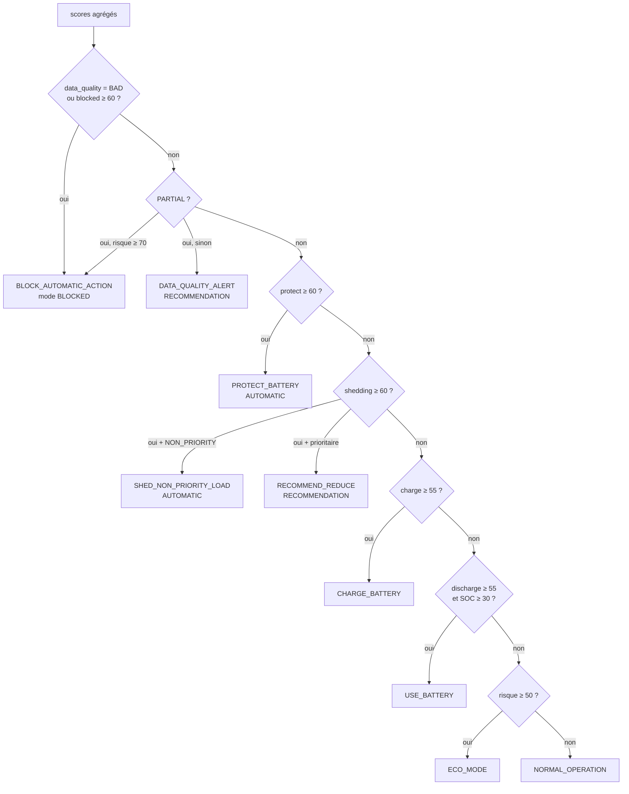

</details>

**Garde-fous** (les plus importants du système) :

- `data_quality = BAD` **bloque** toute action automatique, avant tout le reste.
- Une charge `CRITICAL` ne peut **jamais** être délestée automatiquement : la
  décision est rétrogradée en `RECOMMEND_REDUCE_PRIORITY_LOAD`.
- Trois modes d'exécution : `AUTOMATIC`, `RECOMMENDATION`, `BLOCKED`.

### 1.8 Sortie et persistance

`POST /api/decisions/trigger/` (`fuzzy_engine/views.py`) enregistre un objet
`Decision` complet — dont `fired_rules`, `input_facts` et `fuzzy_values` en JSON,
ce qui rend chaque décision **entièrement traçable et rejouable**. Si l'action
est critique, une `Alert` est levée.

---

## 2. Prévision (ML)

Implémentation : `ems-backend/apps/forecasting/services.py` (1079 lignes).

### 2.1 Deux backends d'inférence


<details>
<summary>Source Mermaid (diagramme éditable)</summary>

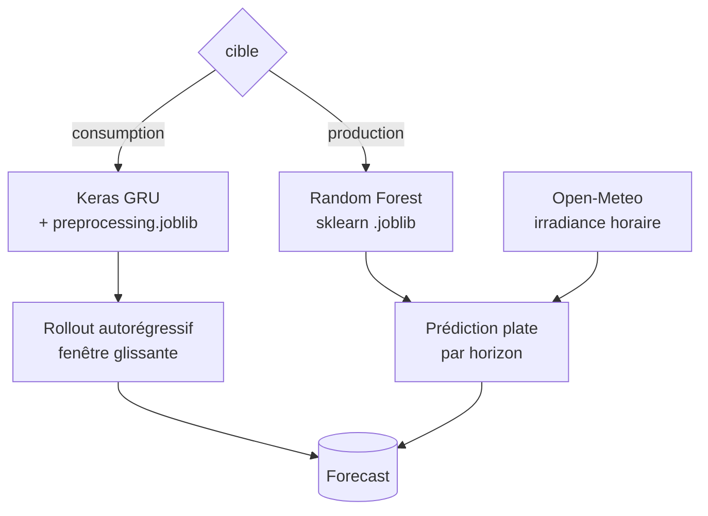

</details>

**Règle d'or assumée dans le code** : il n'existe **aucun repli mathématique**.
Sans modèle actif, le service lève `NoActiveModelError` plutôt que d'inventer des
chiffres plausibles. La plateforme n'affiche que des prédictions issues des
modèles réellement entraînés — argument de rigueur à valoriser dans le mémoire.

### 2.2 Consommation — GRU autorégressif (`_rollout_consumption_gru`)

Le modèle a été entraîné sur une cadence **10 minutes** pour prédire *le pas
suivant* — pas « la valeur dans une heure ». Le rollout respecte cela :

1. Construire la fenêtre initiale (`sequence_length` pas) depuis l'historique
   réel, rééchantillonné sur la grille 10 min (report de la dernière valeur).
2. Prédire le pas suivant, l'ajouter à la fenêtre, retirer le plus ancien,
   avancer l'horloge, recommencer.

Chaque point dépend donc réellement du précédent — c'est ce qui évite la panne
classique de la « fenêtre figée » qui ferait répéter la même valeur.

### 2.3 Production — Random Forest plat (`_predict_pv_sklearn`)

Le RF n'a **aucune fenêtre historique** : chaque horizon est prédit à partir de
la météo prévue *pour cet horizon* + les caractéristiques du panneau. Il est donc
structurellement immunisé contre la répétition. Un post-traitement
(`_apply_production_night_zero`) force la production à zéro la nuit.

### 2.4 Météo et coordonnées

`_weather_forecast_lookup` interroge Open-Meteo aux coordonnées **de la maison**
(`_house_coordinates`), avec cache TTL 600 s — sans lui, chaque requête coûterait
~12 s (5 appels HTTP séquentiels).

```python
# services.py:212
def _house_coordinates(house) -> tuple[float, float]:
    default_lat = float(os.getenv("WEATHER_LATITUDE", "-4.3276"))   # Kinshasa
    default_lon = float(os.getenv("WEATHER_LONGITUDE", "15.3136"))
    if house is None:
        return default_lat, default_lon
    return house.latitude or default_lat, house.longitude or default_lon
```

C'est le point d'accroche de la géolocalisation ([§5.2](#52-géolocalisation--position-réelle-au-lieu-de-saisie-manuelle)).

---

## 3. Chaîne complète, de bout en bout

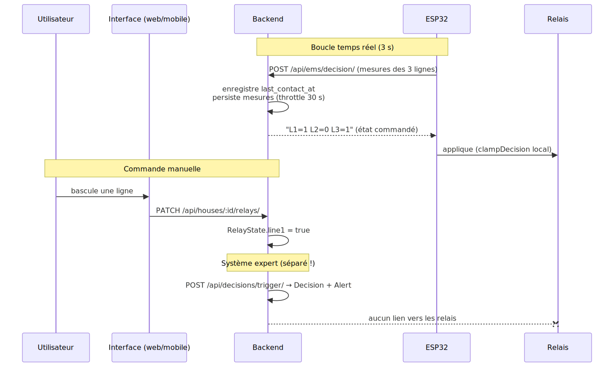

<details>
<summary>Source Mermaid (diagramme éditable)</summary>

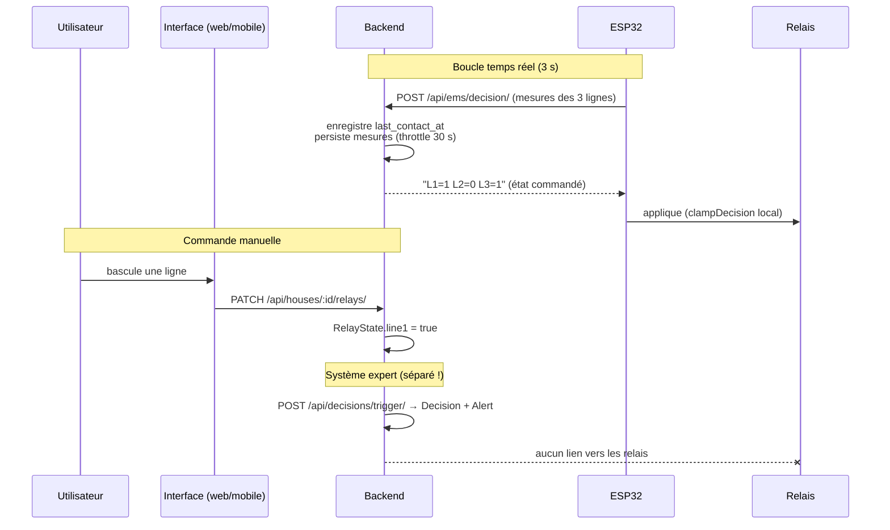

</details>

### Sécurité en profondeur (déjà en place)

| Niveau | Garde-fou | Fichier |
|--------|-----------|---------|
| Firmware | tous relais OFF au boot, avant `pinMode` | `EMS_ESP32.ino` |
| Firmware | `clampDecision` : jamais d'activation en surcharge | `EMS_ESP32.ino` |
| Firmware | backend muet 3× → délestage L2 | `config.h` |
| Backend | aucun ordre connu → `L1=0;L2=0;L3=0` | `devices/views.py` |
| Expert | `BAD` data → blocage automatique | `decision_mapper.py` |
| Expert | charge `CRITICAL` jamais délestée | `decision_mapper.py` |

---

## 4. La boucle décision → relais — [FERMÉE]

> **Historique** : jusqu'au 17/07/2026, la boucle était *ouverte* — le système
> expert produisait des `Decision` (+ `Alert`) sans jamais toucher les relais.
> `SHED_NON_PRIORITY_LOAD` s'affichait mais ne délestait rien. Ce lien manquant
> était le point n°1 à traiter ; il est désormais implémenté.

**Le lien existe maintenant**, via un **mode de contrôle** par maison
(`RelayState.control_mode`) :

| Mode | Comportement |
|------|--------------|
| `MANUAL` (défaut) | l'humain seul commande les lignes — comportement historique, inchangé |
| `AUTO` | le système expert applique ses décisions automatiques aux lignes |

En mode `AUTO`, le backend évalue le moteur flou à chaque relevé du nœud, traduit
la décision en états de lignes (`fuzzy_engine/actuator.py:desired_lines_for_decision`)
et met à jour le `RelayState` que l'ESP32 vient lire — **mais seulement si la
décision est soutenue**. Une coupure (ou un rétablissement) n'est appliquée que
si le même état candidat persiste pendant `EMS_AUTO_CONFIRM_SECONDS` (défaut
180 s) : on ne déleste pas une charge sur un déficit instantané. Le candidat en
attente est mémorisé dans `RelayState.auto_pending_lines` / `auto_pending_since`.
La même logique est déclenchable *sans délai* depuis l'interface de test (§5.3,
bouton « Appliquer aux relais »), pour la démonstration.


<details>
<summary>Source Mermaid (diagramme éditable)</summary>

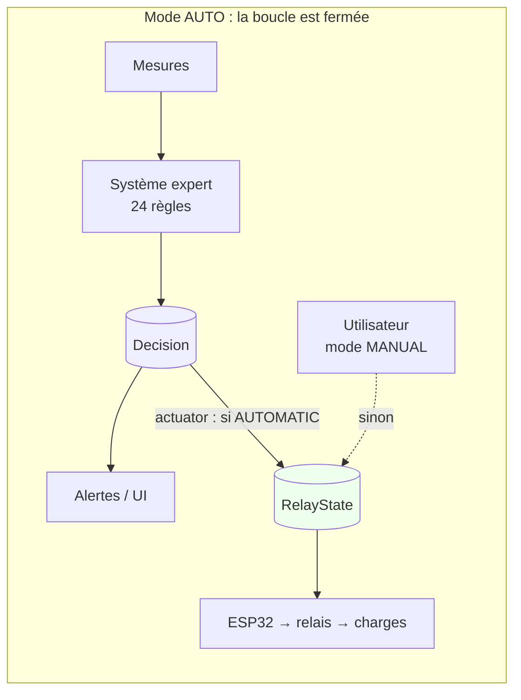

</details>

**Mapping décision → lignes** (`actuator.py`), aligné sur les priorités du
firmware (L3 prioritaire, L1 moyenne, L2 non prioritaire délestée en premier) :

| Décision | L1 | L2 | L3 | Note |
|----------|----|----|----|------|
| `SHED_NON_PRIORITY_LOAD` | ON | **OFF** | ON | déleste la non prioritaire |
| `PROTECT_BATTERY` | **OFF** | **OFF** | ON | ne garde que la prioritaire |
| `NORMAL` / `CHARGE` / `USE_BATTERY` | ON | ON | ON | rien à délester |
| mode `RECOMMENDATION` ou `BLOCKED` | — | — | — | **aucune action** (garde l'état) |

**Garde-fous** (testés dans `tests/test_expert_loop.py`) : seules les décisions
en mode `AUTOMATIC` actionnent ; une recommandation ou un blocage (données
`BAD`) ne touche jamais les lignes ; le `clampDecision` du firmware reste actif
par-dessus. La calibration des capteurs (§5.4) reste le prérequis pour que les
faits — donc les décisions automatiques — soient fiables.

---

## 5. Perspectives d'amélioration

### 5.1 Boucle décision → relais — [IMPLÉMENTÉE] (voir §4)

Fait : mode `MANUAL`/`AUTO` par maison, mapping documenté et testé. Reste en
perspective : un mode `ASSISTED` (l'expert propose, l'utilisateur valide en un
clic) et un mappage explicite charge ↔ ligne (aujourd'hui la priorité des
lignes est conventionnelle : L3 > L1 > L2, alignée sur le firmware).

### 5.2 Géolocalisation — [IMPLÉMENTÉE]

**Enjeu réel** : le Random Forest de production consomme l'irradiance Open-Meteo
*aux coordonnées de la maison* (`services.py:_house_coordinates`). Une coordonnée
fausse ou laissée au défaut Kinshasa ⇒ mauvaise irradiance ⇒ **prévision PV
fausse** ⇒ faits erronés ⇒ décision floue erronée. La géolocalisation n'est donc
pas un confort : c'est la justesse de toute la chaîne.

**Ce qui a été ajouté** (bouton « Utiliser ma position » dans le formulaire
micro-réseau, web et mobile) :

| Couche | Fichier | Apport |
|--------|---------|--------|
| Backend | `houses/serializers.py` | validation des bornes lat ∈ [−90, 90], lon ∈ [−180, 180] — refus propre d'une coordonnée aberrante |
| Web | `Houses.jsx` | `navigator.geolocation.getCurrentPosition` → remplit lat/lon |
| Mobile | `HousesScreen.js` | `expo-location` + permission → remplit lat/lon |
| Mobile | `app.json` | plugin `expo-location` + messages de permission iOS/Android |

Flux implémenté :


<details>
<summary>Source Mermaid (diagramme éditable)</summary>

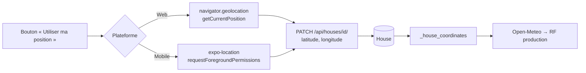

</details>

- **Web** : `navigator.geolocation` — **limite importante** : l'API exige un
  contexte sécurisé (HTTPS **ou** `localhost`). Sur `http://192.168.188.117:5173`
  (IP LAN en clair), le navigateur **bloquera** la localisation. Le code le gère
  proprement : message explicite + la saisie manuelle reste toujours disponible.
  Pour lever la limite : servir le frontend en HTTPS, ou tester depuis
  `http://localhost:5173` sur la machine elle-même.
- **Mobile** : `expo-location`, avec permission explicite — c'est là que ça a le
  plus de sens (l'appareil est *sur place*), et sans la contrainte HTTPS du web.
- **Maison distante simulée** : la saisie manuelle est **conservée** à côté du
  bouton — le besoin « la maison que je veux simuler à distance » reste couvert
  en tapant ses coordonnées. Piste future : recherche par ville → coordonnées.

### 5.3 Interface de test : injection manuelle de faits — [IMPLÉMENTÉE]

Page **« Test expert »** (`ems-frontend/src/pages/ExpertTest.jsx`, menu latéral) :
injecter des faits à la main et observer toute la chaîne, sans attendre de
vraies mesures — pensée pour **démontrer le système expert en soutenance**, hors
ensoleillement réel.

Elle offre :

- curseurs pour production PV, consommation, SOC et température batterie ;
- sélecteur de **qualité des données** (`GOOD`/`PARTIAL`/`BAD`) — pour montrer le
  blocage automatique — et bascule « charges non prioritaires » ;
- la **décision** (code, mode, niveau d'alerte, scores risque/délestage) ;
- les **règles activées** avec leur degré d'activation (barres) ;
- une case **« Appliquer aux relais »** qui ferme la boucle à la demande et
  affiche l'état ON/OFF réellement appliqué à chaque ligne.

Côté backend, `TriggerSerializer` accepte désormais les overrides
`battery_temperature`, `data_quality` et le flag `apply`. Piste future : injecter
aussi les faits *en amont* (tension/courant par ligne) pour tester la chaîne
complète panneau → capteur → décision.

### 5.4 Autres pistes identifiées dans le code

| Piste | Constat |
|-------|---------|
| Règles en base | `get_default_rules()` est figé en Python. `FuzzyExpertEngine(rules=…)` accepte pourtant une liste : un modèle `FuzzyRule` en base rendrait les seuils ajustables sans redéploiement. |
| Repli des prévisions | `_prediction_energy` retombe sur `puissance × 24 h` si aucune prévision — hypothèse grossière (production constante nuit comprise) qui fausse `energy_balance_ratio`. |
| Seuils dupliqués | `MAX_TOTAL_POWER_W` / `MAX_LINE_POWER_W` vivent dans `config.h` ; le backend les ignore. Deux sources de vérité pour une même limite physique. |
| Ordonnancement | Aucune évaluation périodique automatique : `evaluate_house` n'est déclenché que manuellement ou via `run_forecast`. |
| Calibration tension | `CAL_V1…V3` passés de `1.0` à **709,7** (220 V / 0,31 V lus) : le firmware affiche désormais des volts réels, plus ~0,31. Valeur commune approximative — à affiner **ligne par ligne** au multimètre (chaque ZMPT101B a son potentiomètre). |
| Calibration courant | `CAL_I1…I3` encore à `1.0` (aucune mesure de référence fournie) : à calibrer avec une charge connue, `CAL_Ix = courant_réel / iSensorRms`. Tant que ce n'est pas fait, les puissances restent indicatives. |

---

## 6. Feuille de route proposée


<details>
<summary>Source Mermaid (diagramme éditable)</summary>

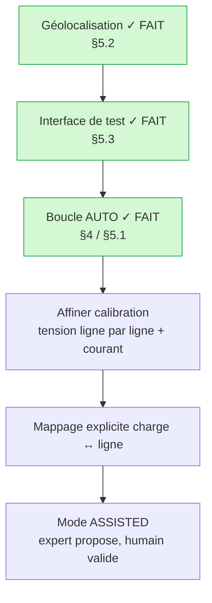

</details>

**Fait** (17/07/2026) : géolocalisation, interface de test, et boucle AUTO
décision → relais. **Point de vigilance** : la boucle AUTO applique des décisions
calculées à partir des mesures capteurs ; tant que la calibration n'est pas
affinée ligne par ligne (§5.4), garder le mode `MANUAL` par défaut et n'activer
`AUTO` que pour la démonstration avec l'interface de test.
