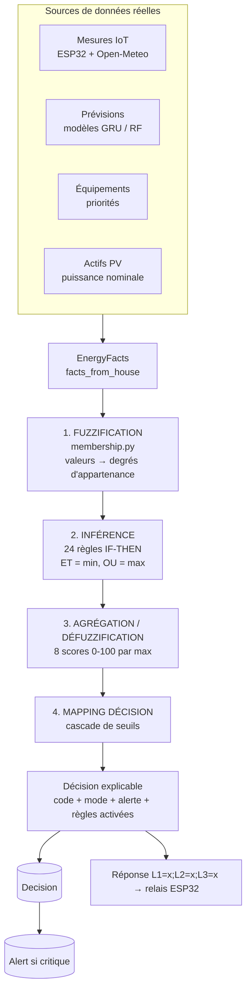

# Architecture du système expert flou (implémentation réelle)

Ce document décrit l'architecture du système expert flou tel qu'il est **réellement
implémenté** dans `ems-backend/apps/fuzzy_engine/`. Les valeurs (ensembles
linguistiques, seuils) sont extraites du code (`core/membership.py`,
`core/decision_mapper.py`).

## 1. Vue d'ensemble : deux couches

```
                    apps/fuzzy_engine/
   ┌──────────────────────────────────────────────────────────┐
   │  engine.py  (ADAPTATEUR Django)                           │
   │   facts_from_house(house)  ── lit les dernières mesures   │
   │                               réelles en base de données  │
   │   evaluate_house(house)    ── exécute le moteur           │
   └───────────────────────────┬──────────────────────────────┘
                               │ EnergyFacts
                               ▼
   ┌──────────────────────────────────────────────────────────┐
   │  core/  (MOTEUR PUR, sans Django)                         │
   │   facts.py + membership.py  →  Fuzzification              │
   │   rules.py + inference.py   →  Inférence (24 règles)      │
   │   defuzzification.py        →  Agrégation (8 scores)      │
   │   decision_mapper.py        →  Décision finale            │
   │   engine.py (FuzzyExpertEngine) orchestre la chaîne       │
   └──────────────────────────────────────────────────────────┘
```

## 2. Pipeline de décision (diagramme)



## 3. Entrées — `EnergyFacts`

Construites par `facts_from_house()` à partir de l'état réel du micro-réseau.

| Champ | Source réelle |
| --- | --- |
| `current_pv_power_kw` | Dernière mesure `production` |
| `current_load_power_kw` | Dernière mesure `consumption` (remontée par l'ESP32) |
| `forecast_pv_energy_kwh` | Intégration des `Forecast` (24 h), sinon `puissance × 24 h` |
| `forecast_load_energy_kwh` | Intégration des `Forecast` (24 h), sinon `puissance × 24 h` |
| `battery_soc_percent` | Dernière mesure `battery_soc` (défaut 50) |
| `battery_temperature_c` | Dernière mesure `temperature` (défaut 25) |
| `load_priority` | Pire priorité parmi les `Equipment` actifs : `CRITICAL` > `PRIORITY` > `NON_PRIORITY` |
| `data_quality` | `GOOD` / `PARTIAL` / `BAD` selon les mesures disponibles |
| `pv_nominal_power_kw` | Somme des `EnergyAsset` PV actifs (défaut 5.0) |

## 4. Étape 1 — Fuzzification (`membership.py`)

Trois ratios dérivés sont d'abord calculés :

- `energy_balance_ratio = énergie_PV_prévue / énergie_conso_prévue`
- `current_load_ratio = consommation_actuelle / production_actuelle`
- `pv_generation_ratio = production_actuelle / puissance_nominale_PV`

Chaque variable est fuzzifiée par fonctions **triangulaires / trapézoïdales** :

| Variable (plage) | Ensembles linguistiques (bornes) |
| --- | --- |
| SoC batterie (0-100 %) | `critique` [0,0,15,25] · `faible` [15,30,45] · `moyen` [35,55,75] · `élevé` [65,85,100,100] |
| Température batterie (0-80 °C) | `normale` [0,0,30,40] · `élevée` [35,45,55] · `dangereuse` [50,60,80,80] |
| Bilan énergétique (0-2) | `déficit_critique` [0,0,0.35,0.60] · `déficit` [0.45,0.70,0.95] · `équilibré` [0.85,1.0,1.20] · `surplus` [1.10,1.35,2,2] |
| Charge actuelle (0-3) | `faible` [0,0,0.5,0.9] · `moyenne` [0.7,1.1,1.5] · `élevée` [1.3,1.8,3,3] |
| Production PV (0-1) | `très_faible` [0,0,0.10,0.25] · `faible` [0.15,0.35,0.55] · `moyenne` [0.45,0.65,0.80] · `élevée` [0.70,0.85,1,1] |
| Qualité données | `good` / `partial` (0.5) / `bad` |

## 5. Étape 2 — Inférence (`rules.py`, `inference.py`)

**24 règles floues** de type IF-THEN. Opérateurs : **ET = minimum**, **OU = maximum**.
Chaque règle activée (degré > seuil) contribue à un ou plusieurs des **8 scores de sortie** :

`risk_score`, `shedding_level`, `charge_battery_score`, `discharge_battery_score`,
`protect_battery_score`, `recommendation_score`, `automatic_score`, `blocked_score`.

Exemples de règles réelles :

| Règle | Condition (résumé) | Effet |
| --- | --- | --- |
| `R001_BATTERY_TEMPERATURE_DANGEROUS` | température batterie dangereuse | protection = 100, risque = 100 |
| `R003_BATTERY_SOC_CRITICAL` | SoC critique | protection = 85, délestage = 80 |
| `R005_CRITICAL_DEFICIT_NON_PRIORITY` | déficit critique ET SoC bas ET charge non prioritaire | délestage = 100, auto = 90 |
| `R006_CRITICAL_DEFICIT_PRIORITY` | déficit critique ET charge prioritaire/critique | délestage = 75, blocage = 35 |
| `R012_SURPLUS_CHARGE_BATTERY_LOW` | surplus ET SoC bas | recharge = 95 |
| `R017_BAD_DATA_QUALITY` | qualité de données mauvaise | blocage = 100 |
| `R023_CRITICAL_LOAD_PROTECTION` | charge critique | blocage = 35 (interdit toute coupure auto) |
| `R024_SENSOR_DATA_ANOMALY` | anomalie capteur ET risque | blocage = 95 |

## 6. Étape 3 — Agrégation / Défuzzification (`defuzzification.py`)

Pour chaque score, la contribution retenue est le **maximum** des règles activées,
borné à l'intervalle **[0, 100]**. On obtient un vecteur de 8 scores résumant la
situation énergétique.

## 7. Étape 4 — Mapping de décision (`decision_mapper.py`)

Cascade de seuils sur les scores et les faits, produisant **une seule** décision
parmi 9, avec un **mode d'exécution** :

```
si data_quality == BAD ou blocage ≥ 60      → BLOCK_AUTOMATIC_ACTION   (BLOCKED)
sinon si data_quality == PARTIAL            → DATA_QUALITY_ALERT / BLOCK
sinon si protection ≥ 60                     → PROTECT_BATTERY          (AUTOMATIC)
sinon si délestage ≥ 60 et charge NON_PRIO   → SHED_NON_PRIORITY_LOAD   (AUTOMATIC)
sinon si délestage ≥ 60 et charge prioritaire→ RECOMMEND_REDUCE_...     (RECOMMENDATION)
sinon si recharge ≥ 55                        → CHARGE_BATTERY           (AUTOMATIC)
sinon si décharge ≥ 55 et SoC ≥ 30            → USE_BATTERY              (AUTOMATIC)
sinon si risque ≥ 50                          → ECO_MODE                 (RECOMMENDATION)
sinon                                         → NORMAL_OPERATION
```

**Garde-fou de sécurité** : une charge `CRITICAL` n'est **jamais** délestée
automatiquement — le délestage est converti en simple recommandation.

Sorties complémentaires :
- **`alert_level`** : `NONE` / `INFO` (risque ≥ 20) / `WARNING` (≥ 45) / `CRITICAL` (≥ 75).
- **`battery_action`** : `PROTECT` / `CHARGE` / `DISCHARGE` / `PRESERVE` / `NONE`.
- **`explanation`** : texte en français + liste des règles activées (traçabilité).

## 8. Sortie et persistance

`EnergyDecisionResult` → modèle Django `Decision` (avec `fired_rules`,
`input_facts`, `fuzzy_values`, scores) → `Alert` si situation critique/warning.
La décision est aussi consultable via `GET /api/decisions/{id}/`.

## 9. Exemple réel (évaluation en direct)

Sur le micro-réseau « Ferme PV Goma » (dernières mesures réelles) :

```
Entrées : PV=0.219 kW · conso=0.497 kW · SoC=68.8 % · T_batt=21.4 °C
          prévu PV=5.3 kWh · prévu conso=11.9 kWh · priorité=CRITICAL · qualité=GOOD
Décision : RECOMMEND_REDUCE_PRIORITY_LOAD (mode RECOMMENDATION, alerte CRITICAL, confiance 0.9)
Règles activées : R006 (0.64), R007 (0.64), R011 (0.64), R019 (1.0), R023 (1.0)
```

Le déficit prévu (5.3 < 11.9 kWh) et la charge critique déclenchent une
recommandation de réduction sans coupure automatique — cohérent avec le
garde-fou « charge critique jamais coupée ».
