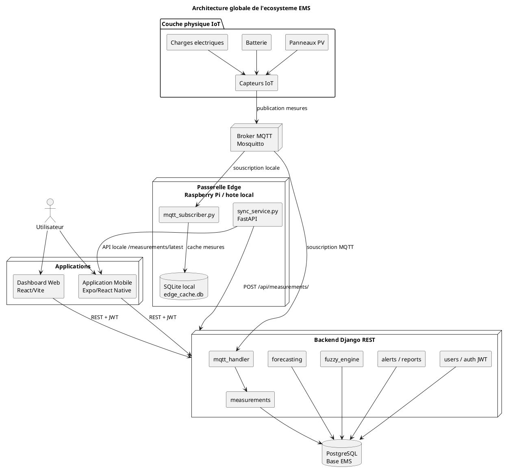
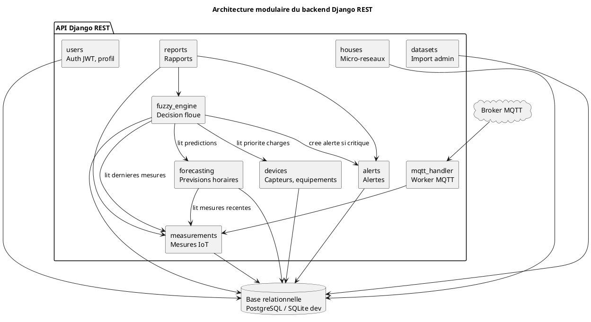
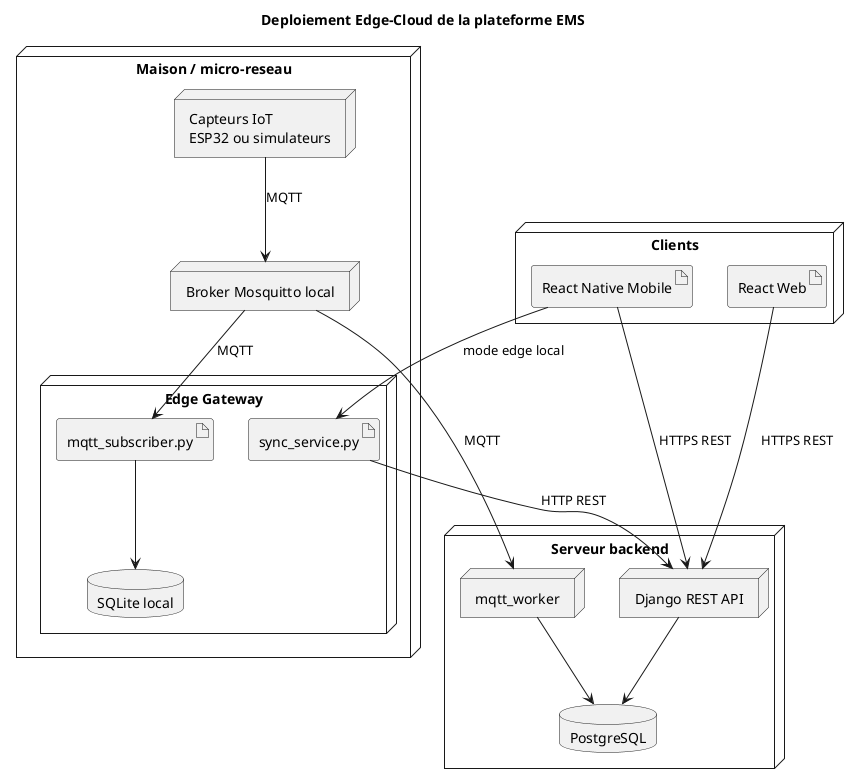
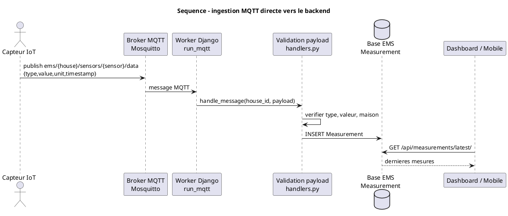
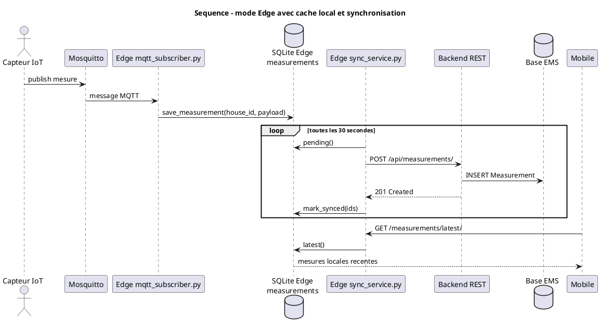
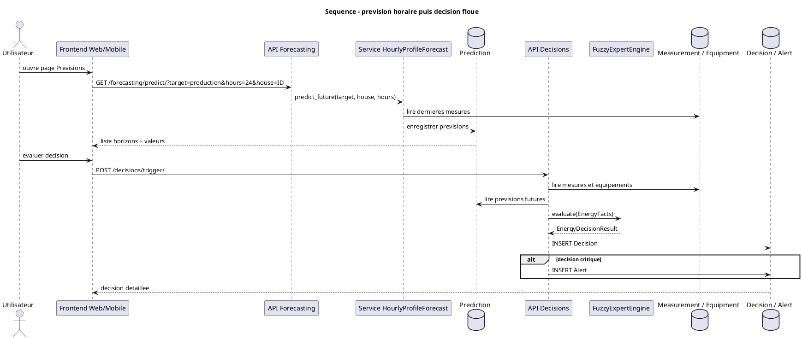
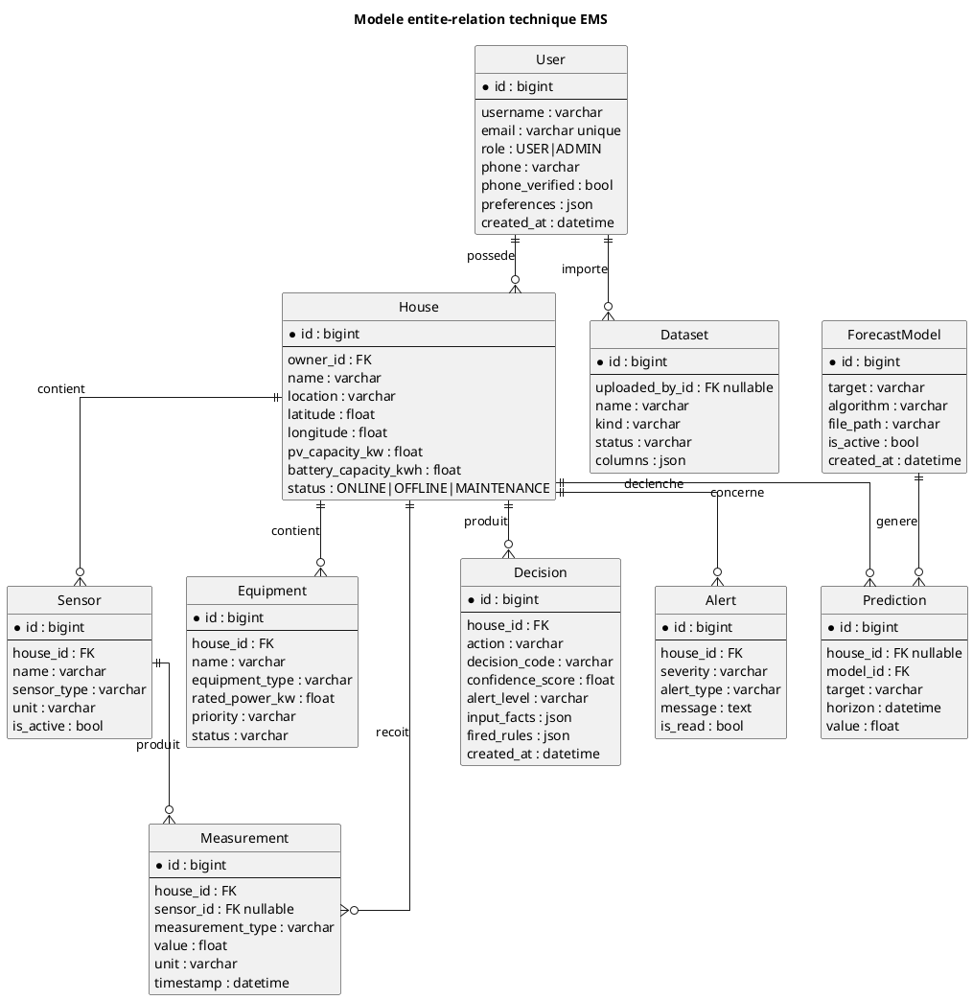
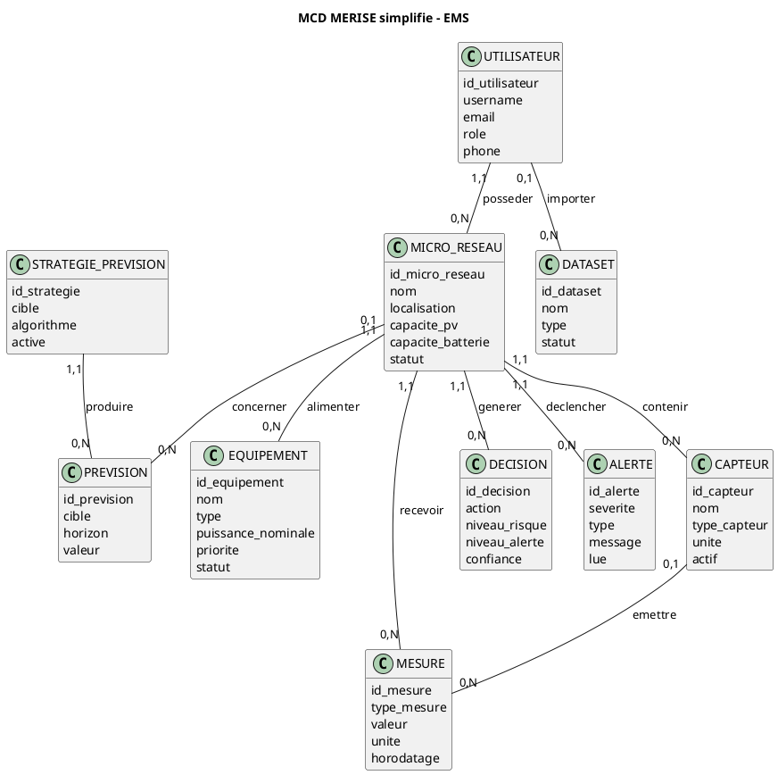
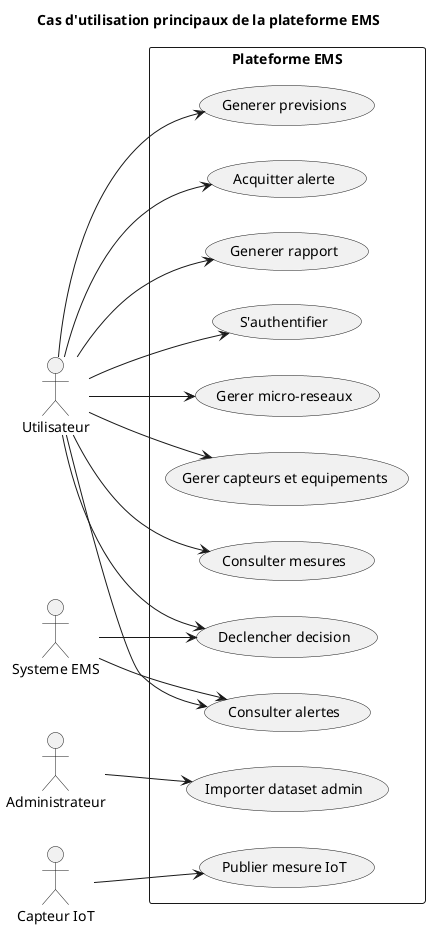
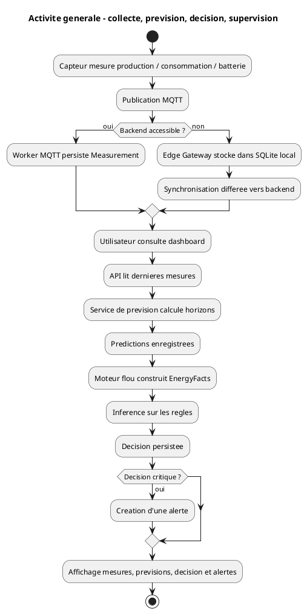

 # Rapport de modelisation - Backend, base de donnees et architecture IoT EMS

## 1. Objet du rapport

Ce rapport documente l'architecture technique actuelle de la plateforme EMS
(`ems-platform`) afin de faciliter son integration dans le memoire intitule
**"Conception d'un ecosysteme IoT pour la gestion intelligente de l'energie et
applications multiplateformes dediees"**.

L'analyse porte sur :

- l'architecture backend Django REST ;
- le modele de donnees et les relations principales ;
- le flux IoT, MQTT et Edge Gateway ;
- le module de prevision horaire ;
- le systeme expert flou de decision energetique ;
- une modelisation MERISE exploitable dans le memoire ;
- des codes PlantUML prets a generer des diagrammes.

Sources analysees :

- `ems-backend/apps/*`
- `ems-backend/config/settings/base.py`
- `docker-compose.yml`
- `mqtt/mosquitto.conf`
- `edge-gateway/*`
- `docs/architecture.md`
- `docs/api-endpoints.md`
- `docs/fuzzy-system.md`
- PDF du memoire : `memoire_iot_latex_modeles_architectures_corrige.pdf`

## 2. Synthese de l'architecture realisee

La plateforme EMS est concue comme un ecosysteme IoT modulaire de gestion
energetique pour micro-reseau domestique. Elle combine :

- une couche physique composee de capteurs, charges, batterie et production PV ;
- une couche communication basee sur MQTT et HTTP REST ;
- une couche ingestion et persistance des mesures ;
- une couche de prevision horaire production/consommation ;
- une couche de decision par systeme expert flou ;
- une couche supervision composee d'un dashboard web React et d'une application
  mobile Expo/React Native ;
- une passerelle Edge permettant la continuite locale en cas d'indisponibilite
  du backend cloud.

Le backend est un **monolithe modulaire Django REST Framework**. Chaque domaine
fonctionnel est isole dans une app Django :

| App backend | Role |
|---|---|
| `users` | Authentification JWT, roles, profil, verification telephone |
| `houses` | Gestion des micro-reseaux domestiques |
| `devices` | Capteurs et equipements/charges |
| `measurements` | Mesures IoT historisees |
| `forecasting` | Previsions horaires production/consommation |
| `fuzzy_engine` | Systeme expert flou et decisions |
| `alerts` | Alertes energetiques |
| `reports` | Rapports journaliers et export CSV |
| `datasets` | Import admin/interne de fichiers CSV/JSON |
| `mqtt_handler` | Worker MQTT et persistance des mesures |

## 3. Note importante sur la coherence du memoire

Le PDF du memoire mentionne encore **Random Forest** comme modele principal de
prevision. Le backend actuel implemente plutot une strategie nommee
`HourlyProfileForecast`, qui calcule les previsions horaires a partir :

- des dernieres mesures de production/consommation ;
- de la capacite PV du micro-reseau ;
- de profils horaires simples pour la courbe solaire et la consommation.

Il faut donc harmoniser le memoire de l'une des deux manieres suivantes :

1. **Option recommandee si tu gardes le code actuel** : presenter Random Forest
   comme modele etudie ou perspective, puis expliquer que l'implementation
   actuelle utilise une approche de prevision horaire par profil, suffisante
   pour valider l'integration prevision -> decision -> supervision.
2. **Option alternative** : reintegrer un vrai entrainement Random Forest dans
   le backend et adapter l'interface admin. Cette option est plus lourde et
   moins coherente avec ta demande recente de ne pas faire d'entrainement depuis
   la plateforme.

Pour ton memoire, tu peux formuler ainsi :

> Dans la version implementee, le module de prevision repose sur une strategie
> horaire deterministe `HourlyProfileForecast`. Cette strategie constitue une
> base fonctionnelle permettant de generer des horizons de production et de
> consommation a court terme. Elle a ete retenue pour valider l'integration
> logicielle entre les mesures IoT, la prevision, le moteur flou et les
> interfaces de supervision. Des modeles d'apprentissage plus avances, tels que
> Random Forest ou LSTM, peuvent etre integres ulterieurement au meme module.

## 4. Methodologie proposee pour le memoire

La methodologie peut etre structuree en sept etapes.

### 4.1 Analyse du besoin

Le besoin initial est de depasser une supervision energetique passive. Le
systeme doit collecter les donnees, les stocker, anticiper l'evolution
energetique, produire des decisions et afficher l'etat du micro-reseau a
l'utilisateur.

Objectifs fonctionnels :

- collecter les mesures IoT en temps reel ;
- visualiser la production, la consommation, la batterie et les alertes ;
- prevoir la production et la consommation a court terme ;
- declencher des decisions energetiques explicables ;
- notifier l'utilisateur en cas de situation critique ;
- permettre un fonctionnement partiel en mode Edge.

### 4.2 Conception en couches

La plateforme est decomposee en couches afin de separer les responsabilites :

- couche physique : panneaux PV, batterie, charges, capteurs ;
- couche communication : MQTT pour l'IoT, HTTP REST pour les applications ;
- couche persistance : PostgreSQL en production, SQLite en developpement ;
- couche traitement : prevision horaire et systeme expert flou ;
- couche applicative : dashboard web et application mobile ;
- couche edge : cache local et synchronisation avec le backend.

### 4.3 Modelisation des donnees

La modelisation est centree sur le micro-reseau. Chaque micro-reseau appartient
a un utilisateur et regroupe des capteurs, equipements, mesures, previsions,
decisions et alertes.

Le modele respecte une separation entre :

- les donnees brutes : `Measurement` ;
- les resultats calcules : `Prediction`, `Decision`, `Alert` ;
- les donnees de configuration : `House`, `Sensor`, `Equipment`, `ForecastModel`.

### 4.4 Acquisition IoT

Les capteurs publient les mesures sur des topics MQTT :

- `ems/{house_id}/sensors/{sensor_id}/data`
- `ems/{house_id}/battery/data`
- `ems/{house_id}/status`

Le backend peut consommer ces topics via `run_mqtt`. La passerelle Edge peut
egalement les consommer et les stocker localement avant synchronisation.

### 4.5 Prevision energetique

L'endpoint :

```text
GET /api/forecasting/predict/?target=production&hours=24&house=ID
```

retourne des previsions horaires. Les cibles valides sont :

- `production`
- `consumption`

Les previsions sont persistees dans la table `Prediction`, afin d'etre
reutilisees par les interfaces et le systeme expert.

### 4.6 Decision par systeme expert flou

Le moteur flou construit un objet `EnergyFacts` a partir :

- des dernieres mesures ;
- des previsions stockees ;
- du niveau de batterie ;
- de la temperature batterie si disponible ;
- de la priorite des charges ;
- de la qualite des donnees.

Il applique ensuite les regles floues et genere une decision persistee dans
`Decision`. Certaines decisions critiques generent automatiquement une `Alert`.

### 4.7 Validation

La validation du backend repose sur :

- tests unitaires et fonctionnels `pytest` ;
- verification des endpoints REST ;
- controle des migrations Django ;
- generation de donnees seed pour simuler des maisons, capteurs, mesures,
  previsions, decisions et alertes.

## 5. Architecture backend detaillee

Le backend repose sur Django REST Framework. Les apps Django forment des modules
metier faiblement couples.

### 5.1 Authentification et utilisateurs

Module : `apps.users`

Fonctions :

- inscription ;
- connexion JWT via SimpleJWT ;
- refresh token ;
- profil courant ;
- changement de mot de passe ;
- verification telephone par code.

Entites :

- `User`
- `PhoneVerificationCode`

### 5.2 Micro-reseaux

Module : `apps.houses`

Un micro-reseau represente une residence ou site energetique. Il contient :

- nom ;
- localisation ;
- coordonnees GPS ;
- capacite PV ;
- capacite batterie ;
- statut.

### 5.3 Capteurs et equipements

Module : `apps.devices`

Un micro-reseau contient :

- des capteurs : production, consommation, batterie, tension, courant,
  puissance, temperature ;
- des equipements : charges electriques avec puissance nominale, priorite et
  statut.

Les priorites des equipements sont importantes pour le moteur flou :

- `CRITICAL`
- `IMPORTANT`
- `NORMAL`
- `NON_CRITICAL`

### 5.4 Mesures IoT

Module : `apps.measurements`

Une mesure est associee a un micro-reseau et optionnellement a un capteur. Elle
contient :

- type ;
- valeur ;
- unite ;
- horodatage.

La table `Measurement` contient un index sur :

```text
(house, measurement_type, -timestamp)
```

Cet index optimise les requetes de derniere mesure par type.

### 5.5 Previsions

Module : `apps.forecasting`

Entites :

- `ForecastModel` : metadata de strategie de prevision ;
- `Prediction` : point de prevision horaire.

La strategie active actuelle est :

```text
HourlyProfileForecast
```

Elle produit des horizons de 1 a 168 heures maximum.

### 5.6 Systeme expert flou

Module : `apps.fuzzy_engine`

Le moteur est organise en sous-modules :

- `facts.py` : fuzzification des faits ;
- `membership.py` : fonctions d'appartenance ;
- `rules.py` : base de regles ;
- `inference.py` : inference floue ;
- `defuzzification.py` : aggregation/defuzzification ;
- `decision_mapper.py` : traduction des scores en decision ;
- `engine.py` : point d'entree.

Les decisions sont stockees dans `Decision` avec des champs explicables :

- code de decision ;
- libelle ;
- niveau de risque ;
- niveau d'alerte ;
- regles activees ;
- faits d'entree ;
- valeurs floues.

### 5.7 Alertes

Module : `apps.alerts`

Les alertes sont associees a un micro-reseau. Elles portent une severite :

- `INFO`
- `WARNING`
- `CRITICAL`

Elles peuvent etre marquees comme lues.

### 5.8 Rapports

Module : `apps.reports`

Il ne contient pas de table dediee. Les rapports sont calcules dynamiquement a
partir de :

- `Measurement`
- `Decision`
- `Alert`

Endpoints :

- `GET /api/reports/daily/`
- `GET /api/reports/export/csv/`

### 5.9 Datasets

Module : `apps.datasets`

Ce module est reserve a l'administration/interne. Il permet d'importer des
fichiers CSV/JSON. Il ne fait plus partie du parcours utilisateur principal de
prevision.

## 6. Modelisation de la base de donnees

### 6.1 Entites principales

| Entite | Table Django | Description |
|---|---|---|
| Utilisateur | `users_user` | Compte, role, profil |
| Code verification | `users_phoneverificationcode` | Code de verification telephone |
| Micro-reseau | `houses_house` | Residence/site energetique |
| Capteur | `devices_sensor` | Capteur physique ou simule |
| Equipement | `devices_equipment` | Charge electrique pilotable |
| Mesure | `measurements_measurement` | Donnee IoT horodatee |
| Strategie prevision | `forecasting_forecastmodel` | Metadata de prevision |
| Prevision | `forecasting_prediction` | Valeur prevue pour un horizon |
| Decision | `fuzzy_engine_decision` | Decision du moteur flou |
| Alerte | `alerts_alert` | Notification energetique |
| Dataset | `datasets_dataset` | Import admin/interne |

### 6.2 Relations principales

| Relation | Cardinalite |
|---|---|
| Un utilisateur possede plusieurs micro-reseaux | `User 1,N House` |
| Un micro-reseau possede plusieurs capteurs | `House 1,N Sensor` |
| Un micro-reseau possede plusieurs equipements | `House 1,N Equipment` |
| Un micro-reseau produit plusieurs mesures | `House 1,N Measurement` |
| Un capteur peut produire plusieurs mesures | `Sensor 0,N Measurement` |
| Un micro-reseau possede plusieurs previsions | `House 0,N Prediction` |
| Une strategie produit plusieurs previsions | `ForecastModel 1,N Prediction` |
| Un micro-reseau genere plusieurs decisions | `House 1,N Decision` |
| Un micro-reseau genere plusieurs alertes | `House 1,N Alert` |
| Un utilisateur peut importer plusieurs datasets | `User 0,N Dataset` |

## 7. MERISE

MERISE reste acceptable dans un memoire francophone, surtout pour documenter le
systeme d'information et la base de donnees. Il est pertinent de l'utiliser en
complement de PlantUML/UML :

- MERISE pour le MCD/MLD/MPD ;
- UML/PlantUML pour architecture, composants, sequences et deploiement.

### 7.1 MCD textuel

Entites :

- UTILISATEUR
- MICRO_RESEAU
- CAPTEUR
- EQUIPEMENT
- MESURE
- STRATEGIE_PREVISION
- PREVISION
- DECISION
- ALERTE
- DATASET
- CODE_VERIFICATION

Associations :

- POSSEDER : UTILISATEUR (1,1) -> MICRO_RESEAU (0,N)
- AVOIR_CAPTEUR : MICRO_RESEAU (1,1) -> CAPTEUR (0,N)
- AVOIR_EQUIPEMENT : MICRO_RESEAU (1,1) -> EQUIPEMENT (0,N)
- PRODUIRE_MESURE : MICRO_RESEAU (1,1) -> MESURE (0,N)
- EMETTRE_MESURE : CAPTEUR (0,1) -> MESURE (0,N)
- GENERER_PREVISION : MICRO_RESEAU (0,1) -> PREVISION (0,N)
- UTILISER_STRATEGIE : STRATEGIE_PREVISION (1,1) -> PREVISION (0,N)
- PRODUIRE_DECISION : MICRO_RESEAU (1,1) -> DECISION (0,N)
- DECLENCHER_ALERTE : MICRO_RESEAU (1,1) -> ALERTE (0,N)
- IMPORTER : UTILISATEUR (0,1) -> DATASET (0,N)

Remarque : `CODE_VERIFICATION` est volontairement lie au numero de telephone
plutot qu'a une cle etrangere utilisateur, car il est utilise avant la creation
effective du compte.

### 7.2 MLD relationnel

```text
UTILISATEUR(
  id PK,
  username,
  email UNIQUE,
  password,
  role,
  phone,
  phone_verified,
  preferences,
  created_at
)

CODE_VERIFICATION(
  id PK,
  phone,
  code_hash,
  expires_at,
  attempts,
  used_at,
  created_at
)

MICRO_RESEAU(
  id PK,
  owner_id FK -> UTILISATEUR.id,
  name,
  location,
  latitude,
  longitude,
  description,
  pv_capacity_kw,
  battery_capacity_kwh,
  status,
  created_at,
  updated_at
)

CAPTEUR(
  id PK,
  house_id FK -> MICRO_RESEAU.id,
  name,
  sensor_type,
  unit,
  is_active,
  created_at
)

EQUIPEMENT(
  id PK,
  house_id FK -> MICRO_RESEAU.id,
  name,
  equipment_type,
  rated_power_kw,
  priority,
  status,
  created_at
)

MESURE(
  id PK,
  house_id FK -> MICRO_RESEAU.id,
  sensor_id FK NULL -> CAPTEUR.id,
  measurement_type,
  value,
  unit,
  timestamp,
  created_at
)

STRATEGIE_PREVISION(
  id PK,
  target,
  algorithm,
  file_path,
  mae,
  rmse,
  r2,
  n_samples,
  is_active,
  created_at
)

PREVISION(
  id PK,
  house_id FK NULL -> MICRO_RESEAU.id,
  model_id FK -> STRATEGIE_PREVISION.id,
  target,
  horizon,
  value,
  created_at
)

DECISION(
  id PK,
  house_id FK -> MICRO_RESEAU.id,
  action,
  reason,
  confidence_score,
  decision_code,
  decision_label,
  execution_mode,
  alert_level,
  risk_score,
  shedding_level,
  charge_battery_score,
  discharge_battery_score,
  protect_battery_score,
  recommendation_score,
  automatic_score,
  blocked_score,
  battery_action,
  explanation,
  input_snapshot JSON,
  activated_rules JSON,
  fired_rules JSON,
  input_facts JSON,
  fuzzy_values JSON,
  created_at
)

ALERTE(
  id PK,
  house_id FK -> MICRO_RESEAU.id,
  severity,
  alert_type,
  message,
  is_read,
  created_at
)

DATASET(
  id PK,
  uploaded_by_id FK NULL -> UTILISATEUR.id,
  name,
  kind,
  file,
  status,
  rows,
  columns JSON,
  message,
  created_at
)
```

### 7.3 MPD cible

Le MPD cible correspond a une base relationnelle PostgreSQL. En developpement,
le projet peut fonctionner avec SQLite, mais `docker-compose.yml` prevoit
PostgreSQL 16.

Index notable :

```text
MESURE(house_id, measurement_type, timestamp DESC)
```

Cet index optimise les lectures frequentes :

- derniere production ;
- derniere consommation ;
- dernier SOC batterie ;
- historique recent par type.

## 8. Modelisation IoT

La partie IoT doit bien etre modelisee dans le memoire, car elle justifie le
caractere "ecosysteme IoT" du projet. Elle peut etre presentee selon trois
niveaux.

### 8.1 Niveau physique

Elements :

- panneaux photovoltaïques ;
- batterie ;
- charges electriques ;
- capteurs de production ;
- capteurs de consommation ;
- capteurs de tension/courant ;
- capteur batterie/SOC ;
- capteur temperature.

### 8.2 Niveau communication

Protocole principal : MQTT.

Topics :

```text
ems/{house_id}/sensors/{sensor_id}/data
ems/{house_id}/battery/data
ems/{house_id}/status
```

Payload minimal attendu :

```json
{
  "type": "production",
  "value": 4.74,
  "unit": "kW",
  "timestamp": "2026-06-19T12:00:00Z",
  "sensor_id": 1
}
```

Types valides :

- `production`
- `consumption`
- `battery_soc`
- `voltage`
- `current`
- `power`
- `temperature`

### 8.3 Niveau edge-cloud

Deux modes sont prevus :

1. Mode backend direct : le worker Django `run_mqtt` lit les messages MQTT et
   cree directement des `Measurement`.
2. Mode Edge : la passerelle locale lit MQTT, stocke dans SQLite local, expose
   une API FastAPI locale, puis synchronise vers le backend REST.

## 9. Codes PlantUML

### 9.1 Architecture globale de l'ecosysteme



### 9.2 Architecture backend modulaire



### 9.3 Diagramme de deploiement Edge-Cloud



### 9.4 Sequence d'acquisition IoT directe



### 9.5 Sequence Edge Gateway



### 9.6 Sequence prevision et decision



### 9.7 Diagramme entite-relation technique



### 9.8 MCD MERISE en PlantUML



### 9.9 Diagramme de cas d'utilisation



### 9.10 Activite generale de traitement energetique



## 10. Proposition d'integration dans le memoire

### 10.1 Dans le chapitre Methodologie

Tu peux ajouter une sous-section :

> Modelisation et architecture logicielle du prototype

Contenu conseille :

- choix d'une architecture modulaire ;
- decomposition en couches ;
- justification de Django REST Framework ;
- role de MQTT dans l'acquisition IoT ;
- role de la passerelle Edge ;
- role de la prevision et du systeme expert flou ;
- justification de MERISE pour la base de donnees.

### 10.2 Dans le chapitre Implementation

Tu peux ajouter :

- diagramme d'architecture backend ;
- diagramme de deploiement Edge-Cloud ;
- diagramme sequence MQTT ;
- MCD/MLD/MPD ;
- tableau des apps Django ;
- tableau des endpoints REST.

### 10.3 Dans le chapitre Validation

Tu peux expliquer que la validation a ete faite sur :

- donnees seed ;
- mesures simulees ;
- tests backend ;
- consultation des pages web/mobile ;
- verification de la chaine complete :

```text
Mesure IoT -> API -> base de donnees -> prevision -> decision -> alerte -> interface
```

## 11. Limites actuelles et perspectives

Limites :

- les capteurs physiques ne sont pas encore decrits comme schema electronique
  complet ;
- la prevision actuelle est une strategie horaire simple, pas un entrainement
  ML complet ;
- les actions sur equipements sont modelisees, mais le pilotage physique
  automatique des relais n'est pas encore implemente ;
- le module `datasets` est reserve admin/interne.

Perspectives :

- integrer un vrai pipeline ML admin pour comparer Random Forest, Gradient
  Boosting et LSTM ;
- ajouter TLS/authentification MQTT ;
- ajouter une file d'attente plus robuste dans la passerelle Edge ;
- piloter physiquement certains equipements via relais ou microcontroleur ;
- enrichir les rapports PDF ;
- ajouter WebSocket pour le temps reel.

## 12. Conclusion

L'architecture implementee constitue une base coherente pour un ecosysteme IoT
de gestion intelligente de l'energie. Le backend est modulaire, la base de
donnees est centree sur le micro-reseau, le flux IoT est pris en charge par
MQTT, et la logique decisionnelle combine prevision horaire et systeme expert
flou.

La modelisation MERISE reste pertinente pour documenter le systeme
d'information, tandis que les diagrammes PlantUML permettent d'expliquer
visuellement les interactions entre capteurs, passerelle Edge, backend,
applications et base de donnees.

